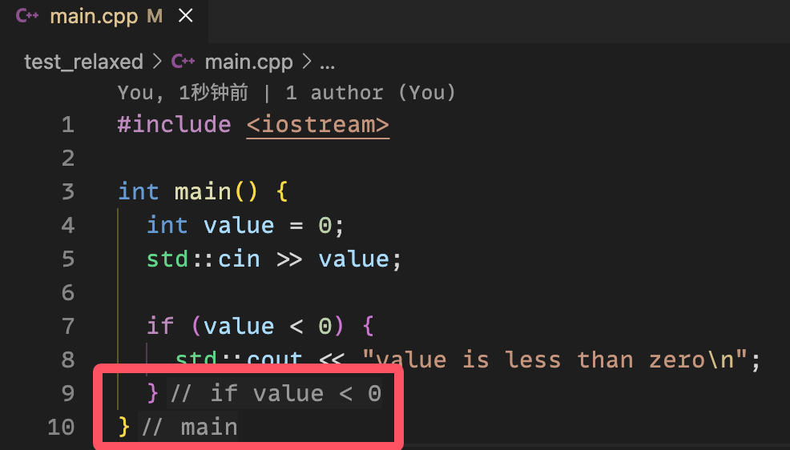
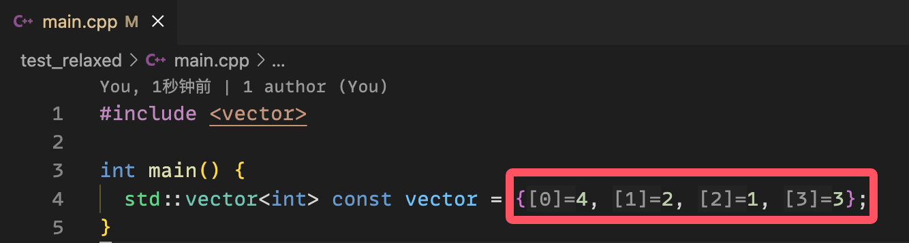

************************************************************************************************************************
关于代码中显示的额外信息
************************************************************************************************************************

本配置利用了 clangd, 会在代码间显示额外信息 (如 :cpp:`if` 语句在哪结束、函数在哪结束、下标序号、类型推导结果等).

**但这有时提示地过多而影响阅读.** 为此, 你可以:

关闭这些额外信息的显示
  打开 test 文件夹下的 main.cpp, :KBD:`Ctrl-Shift-P` 或 :KBD:`Command⌘-Shift-P` 打开命令菜单, 输入 ``inlay hints`` 以找到 :menuselection:`clangd: Toggle inlay hints`, :KBD:`回车`.

  重复此操作可以开启显示.

选择性启用额外信息显示
  打开学习模板下的 .clangd 文件, 按需求开关 ``InlayHints`` 下的选项.

  然后打开 test 文件夹下的 main.cpp, 通过 :KBD:`Ctrl-Shift-P` 或 :KBD:`Command⌘-Shift-P` 打开命令菜单, 输入 ``clangdr`` 以找到 :menuselection:`clangd: Restart language server`, 从而刷新配置.