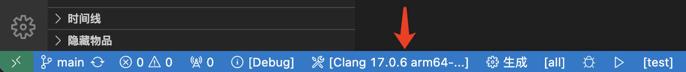
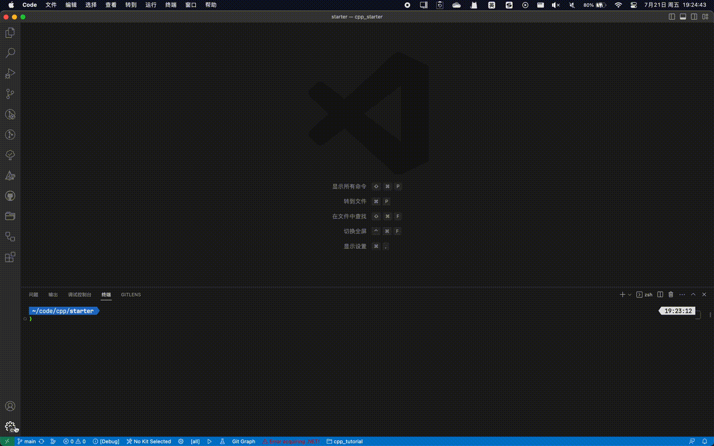
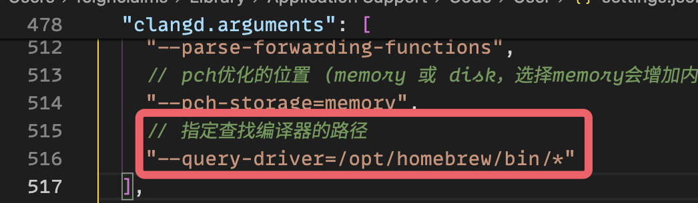

************************************************************************************************************************
更改所用的编译器
************************************************************************************************************************

========================================================================================================================
更改 CMake 所用的编译器
========================================================================================================================

.. hint::

  更推荐方法是通过 :ref:`我的学习建议 <question_board:学习大纲_CMake>` 学习 CMake + Conan, 按照 `FeignClaims/cpp_conan_template`_ 中所解释的编写 Conan profiles, 此后即能生成对应的工具链.

点击状态栏上的 :menuselection:`🛠[你当前激活的编译器/预设]` 从而切换.

  选择编译器

========================================================================================================================
添加编译器到 clangd 的搜索路径
========================================================================================================================

点击窗口左下角的 :menuselection:`齿轮`, 选择 :menuselection:`设置(settings)`, 在弹出的窗口右上角选择 :menuselection:`打开文件 --> 打开当前配置文件设置`.

.. note::

  如果窗口左下角没有齿轮, 请尝试通过 :KBD:`Ctrl-Shift-P` 或 :KBD:`Command⌘-Shift-P` 打开命令菜单, 输入 ``toggle activity bar`` 以找到 :menuselection:`查看：切换活动栏可见性(View: Toggle Activity Bar Visibility)`, :KBD:`回车`.

  打开设置

在打开的 ``settings.json`` 文件中找到 ``"clangd.arguments"``, 在其中插入 ``"--query-driver=你的编译器路径1,你的编译器路径2"``.

  配置搜索编译器的路径

.. warning::

  对于 M 系列芯片的 MacBook, 使用 homebrew 安装的 gcc 时, clangd 可能提示 ``__float128 is not supported on this target``.

  为此, 我在根目录下的 ``.clangd`` 添加了一行以抑制该报错.

  .. code-block:: yaml
    :emphasize-lines: 2
    :linenos:

    Diagnostics:
      Suppress: ["type_unsupported"]
      # ClangTidy: See file `.clang-tidy`
      UnusedIncludes: Strict
      # MissingIncludes: Strict  # Too many false positive
    Index:
      Background: Build
      StandardLibrary: Yes
    InlayHints:
      Enabled: Yes
      ParameterNames: Yes
      DeducedTypes: Yes
      Designators: Yes
    Hover:
      ShowAKA: Yes