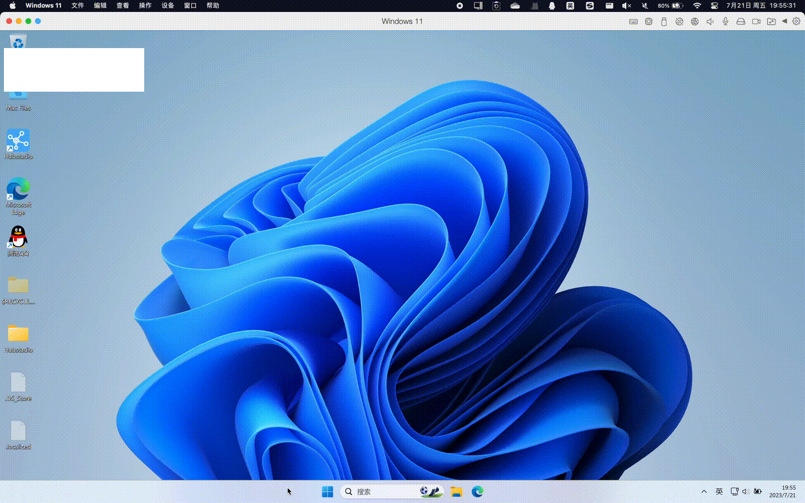

************************************************************************************************************************
Windows 终端输出中文乱码问题
************************************************************************************************************************

这是由于部分版本下, Windows 终端默认编码为 ``gbk``, 而含中文文本的代码文件保存为 ``UTF-8``.

该问题目前没找到通用解决方案, 每种方法都存在局限性或在某些版本下出现问题. 以下是 **部分** 可行的方法:

========================================================================================================================
法1、Windows 11 (及以后?) 更改系统区域设置
========================================================================================================================

在任务栏处 :KBD:`右键` 后选择 :menuselection:`任务栏设置`, 在打开的设置窗口左侧找到搜索框, 输入 ``区域``, 选择提示的 :menuselection:`区域设置`.

切换到 :menuselection:`区域设置` 后, 点击 :menuselection:`管理语言设置`, 在弹出的窗口中点击 :menuselection:`更改系统区域设置(C)...`, 再在弹出的窗口中勾选 ``Beta 版：使用 Unicode UTF-8 提供全球语言支持``, 然后点击 :menuselection:`现在重新启动`.

  打开设置

========================================================================================================================
法2、设置终端启动时自动切换为 ``UTF-8``
========================================================================================================================

点击窗口左下角的 :menuselection:`齿轮`, 选择 :menuselection:`设置(settings)`, 在弹出的窗口右上角选择 :menuselection:`打开文件 --> 打开当前配置文件设置`, 在打开的 ``settings.json`` 文件中找到 ``"terminal.integrated.profiles.windows"``, 并修改 ``"cmd"`` 如下:

.. code-block:: json

  "terminal.integrated.profiles.windows": {
    "cmd": {
      "args": ["/K", "chcp 65001 > nul"],  // 新增加的行
      "icon": "terminal-cmd",
      "path": [
        "${env:windir}/Sysnative/cmd.exe",
        "${env:windir}/System32/cmd.exe"
      ]
    },
  },

.. note::

  如果窗口左下角没有齿轮, 请尝试通过 :KBD:`Ctrl` + :KBD:`Shift` + :KBD:`P` 或 :KBD:`Command ⌘` + :KBD:`Shift` + :KBD:`P` 打开命令菜单, 输入 ``toggle activity bar`` 以找到 :menuselection:`查看: 切换活动栏可见性(View: Toggle Activity Bar Visibility)`, :KBD:`回车`.

.. figure:: VSCode_打开设置.gif

  打开设置

.. warning::

  如果修改后不能执行调试任务, 说明这个方法不适合你.