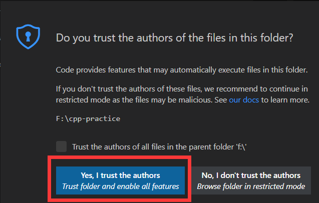
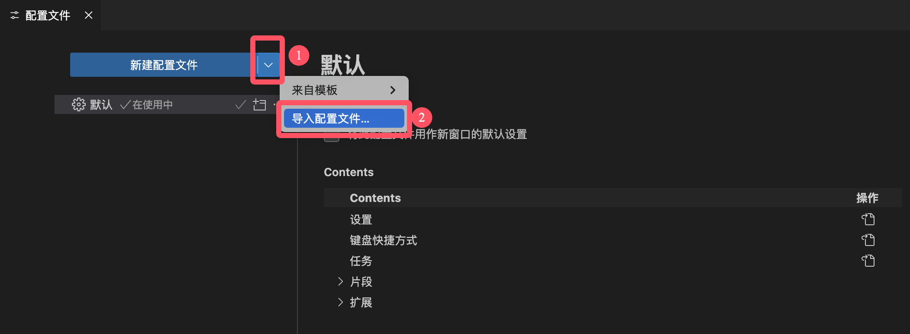
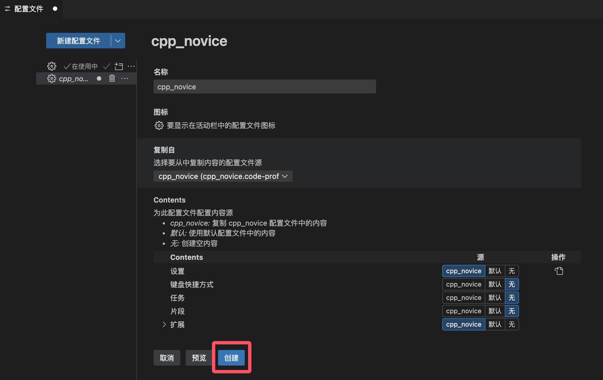
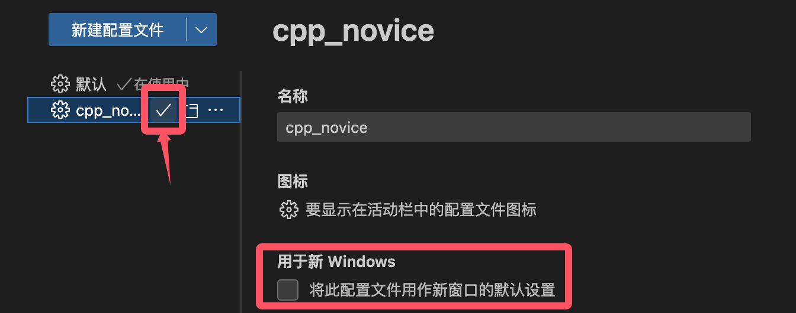
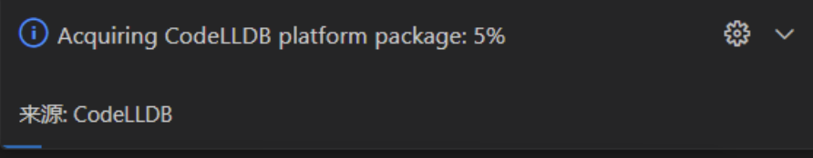
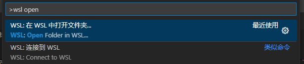
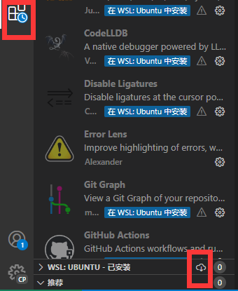

************************************************************************************************************************
2.配置
************************************************************************************************************************

========================================================================================================================
下载并解压学习模板
========================================================================================================================

.. include:: /learning_template.irst

========================================================================================================================
打开文件夹
========================================================================================================================

打开 VSCode, 点击左上角的 :menuselection:`文件(File) --> 打开文件夹...(Open Folder...)`, 然后在弹出的窗口中选择之前解压得到的 cpp_novice 文件夹. 当然, 你可能解压得到的是 ppp2_novice 或 ppp3_novice 文件夹.

.. note::

  - 解压时, 有可能最终得到一个 cpp_novice 文件夹其中又包含一个 cpp_novice 文件夹的情况; 如果出现这种情况, 应该选择的是内层的 cpp_novice 文件夹.
  - 如果没有找到 cpp_novice 文件夹, 请确认自己下载 **并解压** 了学习模板.

在弹出的界面中选择 :menuselection:`是，我信任此作者(Yes, I trust the authros)`.

  安全性提示

========================================================================================================================
导入配置文件
========================================================================================================================

.. note::

  2024-09 更新的 VSCode 1.93 更改了配置文件界面. 如果你使用的是老版本, 请点击窗口左下角的 :menuselection:`齿轮`, 点击 :menuselection:`配置文件(Profiles)` 来更新你的 VSCode.

点击窗口左下角的 :menuselection:`齿轮`, 点击 :menuselection:`配置文件(Profiles)`.

.. note::

  如果窗口左下角没有齿轮, 请尝试通过 :KBD:`Ctrl-Shift-P` 或 :KBD:`Command⌘-Shift-P` 打开命令菜单, 输入 ``toggle activity bar`` 以找到 :menuselection:`查看：切换活动栏可见性(View: Toggle Activity Bar Visibility)`, :KBD:`回车`.

在弹出的窗口中, 点击蓝色按钮右边的下三角下拉按钮, 选择 :menuselection:`导入配置文件...(Import Profile...)`.

  导入配置文件

然后, 在弹出的新窗口中, 点击 :menuselection:`选择文件...`, 然后选择你解压的 ``cpp_novice`` 目录下的 ``cpp_novice.code-profile``.

然后在窗口中点击 :menuselection:`创建` 来完成该配置文件的导入.

  确定创建导入的配置文件

========================================================================================================================
切换至配置文件
========================================================================================================================

点击窗口左下角的 :menuselection:`齿轮`, 选择 :menuselection:`配置文件(Profiles)`.

在弹出的窗口中, 点击 cpp_novice 旁的 :menuselection:`对勾符号✓` 从而切换为使用 cpp_novice 配置文件. 此外, 你还能点击 cpp_novice, 然后在右侧选择让它作为默认配置.

  切换配置文件

.. note::

  此时齿轮旁显示 ``CP``, 表明确实加载该配置文件; 以后在使用中也请注意切换.

切换后, 用于调试程序的 CodeLLDB 插件将会下载它所需的包. 在它下载完之前, 我们无法调试程序, 但这不影响我们继续配置.

    CodeLLDB 下载所需的包

.. note::

  CodeLLDB 所需的包需要通过 github 下载, 因此很容易下载失败. 如果 CodeLLDB 下载失败, 请查询如何成功访问 github (例如 "steam++工具箱" 中可以选择加速 github 访问) 然后重启 VSCode.
  
  或者如果你觉得自己网络没有问题, 你可以尝试点击按钮手动下载, 然后通过 :KBD:`Ctrl-Shift-P` 或 :KBD:`Command⌘-Shift-P` 打开命令菜单, 输入 ``vsix`` 以找到 :menuselection:`扩展: 从 VSIX 安装...`, :KBD:`回车`, 在弹出的窗口中选择刚刚点击按钮下载到的文件.

  .. figure:: VSCode_CodeLLDB下载package失败.png

      CodeLLDB 下载所需的包失败

  .. figure:: VSCode_CodeLLDB下载package失败时的输出.png

      CodeLLDB 下载所需的包失败时的输出

.. error::

  切换配置文件后, 右下角可能弹出如下通知, 询问你是否安装 clangd (Would you like to download and install clangd x.x.x?), **请不要安装!** 我们已经通过其他方式安装好了 clangd, 而 VSCode 提示的版本存在一定的问题, 会导致之后步骤中配置失败.

  .. figure:: VSCode_被推荐安装clangd.png

    被推荐安装 clangd

  如果意外点击, 请点击窗口左下角的 :menuselection:`齿轮`, 选择 :menuselection:`设置(settings)`. 在弹出的窗口中搜索 ``clangd path``, 将其内容改回 ``clangd``.

  .. figure:: VSCode_更改clangd路径.png

    更改 clangd path

========================================================================================================================
WSL 专属步骤: 用 WSL 打开该文件夹
========================================================================================================================

.. danger::

  VSCode 远程窗口 (例如 WSL) 专属步骤, 其他配置方案请忽略这一部分 **往下接着看**.

:KBD:`Ctrl-Shift-P` 或 :KBD:`Command⌘-Shift-P` 打开命令菜单, 输入 ``wsl open`` 以找到 :menuselection:`WSL: 在 WSL 中打开文件夹...`, :KBD:`回车`, 并选择该 cpp_novice 文件夹.

  在 WSL 中打开文件夹

在左边侧边栏找到 :menuselection:`扩展(Extensions)`.

可以发现, 部分扩展需要我们在远程窗口手动安装, 为此我们点击下方 ``WSL:UBUNTU - 已安装`` 旁的 :menuselection:`云状图标`, 在弹出的窗口中全选从而下载.

  为远程窗口安装扩展

========================================================================================================================
为 CMake 选择编译器
========================================================================================================================

重新启动 VSCode, 如果前面的操作无误, 将会弹出如下图选项: (如果失败, 请看下面的备注)

- Windows WSL: 选择 Clang 即可, 请注意选择 **/home/linuxbrew** 下的版本.
- Windows MSYS2: 选择 Clang 即可, 请注意选择 **msys2 安装路径** (默认为 ``C:\msys64``) 下的版本.
- MacOS: 系统自带有 Clang 编译器, 请注意选择 **homebrew** 路径下的版本.
- Linux: 选择 Clang 即可.

.. tabs::

  .. tab:: Windows WSL 选择编译器

    .. figure:: WSL_选择编译器.png

  .. tab:: MacOS 选择编译器

    .. figure:: MacOS_选择编译器.png

.. note::

  如果没有弹出, 请

  扫描工具包
    :KBD:`Ctrl-Shift-P` 或 :KBD:`Command⌘-Shift-P` 打开命令菜单, 输入 ``cmake kit`` 以找到 :menuselection:`CMake: 扫描工具包`, :KBD:`回车`.

  选择工具包
    :KBD:`Ctrl-Shift-P` 或 :KBD:`Command⌘-Shift-P` 打开命令菜单, 输入 ``cmake kit`` 以找到 :menuselection:`CMake: 选择工具包`, :KBD:`回车`.

  配置 CMake
    :KBD:`Ctrl-Shift-P` 或 :KBD:`Command⌘-Shift-P` 打开命令菜单, 输入 ``cmake configure`` 以找到 :menuselection:`CMake: 配置`, :KBD:`回车`.

.. note::

  如果配置失败或没有找到对应的编译器, 请

  1. 复查之前 (包括 "1.下载和安装") 有没有遗漏步骤, Windows MSYS2 要尤其检查一下之前步骤中环境变量有没有设置上;
  2. **删除 build 文件夹** (如果有的话);
  3. 重新扫描工具包、选择工具包和配置 CMake.

  .. figure:: CMake配置失败.png

    CMake 配置失败

如果配置成功, :menuselection:`输出` 中将会显示有以下两行:

.. code-block:: text

  [cmake] -- Configuring done (??.??s)  <- 显示的时间可能不同
  [cmake] -- Generating done (??.??s)

========================================================================================================================
配置完成
========================================================================================================================

打开 test 文件夹下的 main.cpp, 通过 :KBD:`Ctrl-Shift-P` 或 :KBD:`Command⌘-Shift-P` 打开命令菜单, 输入 ``clangdr`` 以找到 :menuselection:`clangd: Restart language server`, 从而刷新配置.

.. note::

  当你的 C++ 源代码莫名其妙显示错误信息时, 通过该步骤可能得到解决.

.. figure:: VSCode_刷新_clangd.png

  刷新 Clangd

现在配置已经完成了, 但 **配置仅在 VSCode 打开这个学习模板文件夹时有效**, 而不能 (也不该 [#1]_) 应用于其他文件夹. 这对于初学者没有什么影响, 你本来就是用这个 cpp_novice 文件夹作为学习 C++ 所用的文件夹.

.. [#1] VSCode 打开一个像学习模板这样有一个 CMakeLists.txt 文件的文件夹, 就是认为该文件夹构成了一个 C++ 代码项目, 每个项目都是且应该是独立的, 其配置自然不应该共享. 如果需要在其他文件夹中应用配置, 请看 :doc:`/appendix/explain`.

运行、调试代码和添加更多程序的方法见下文.
