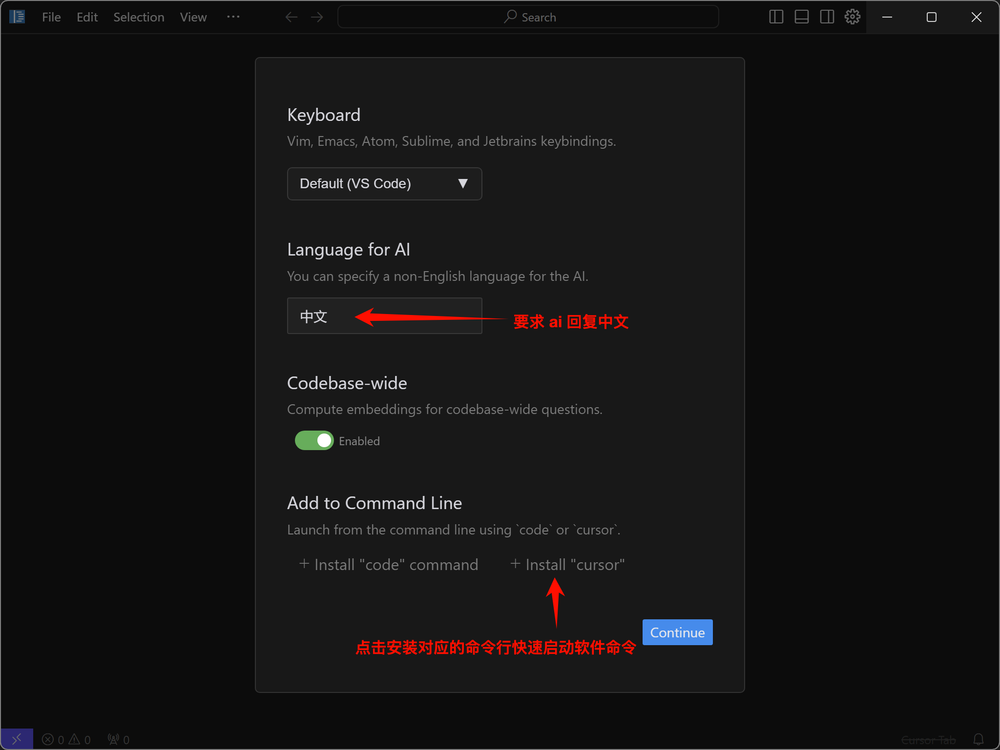
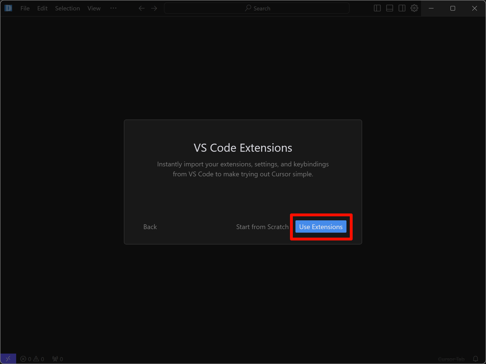
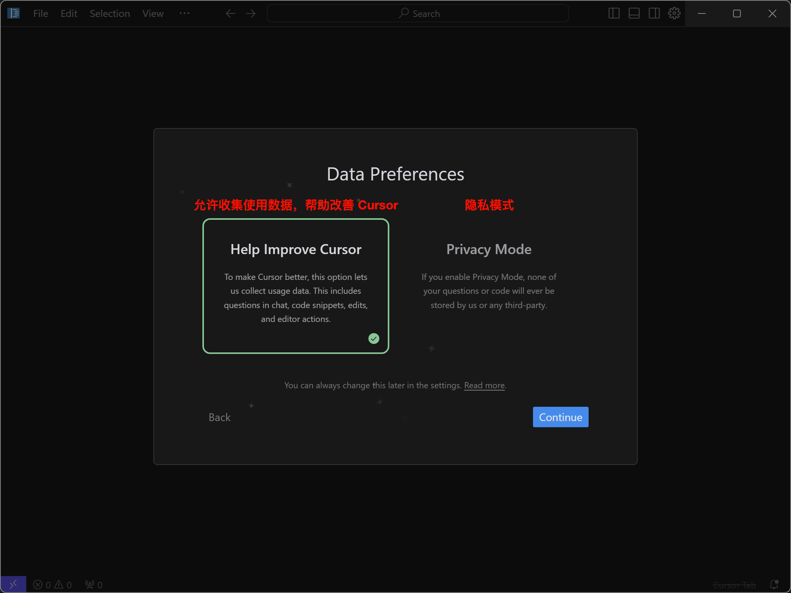
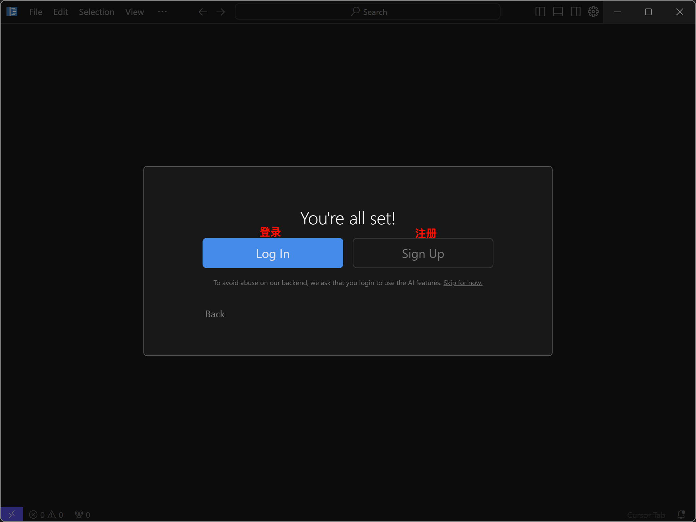
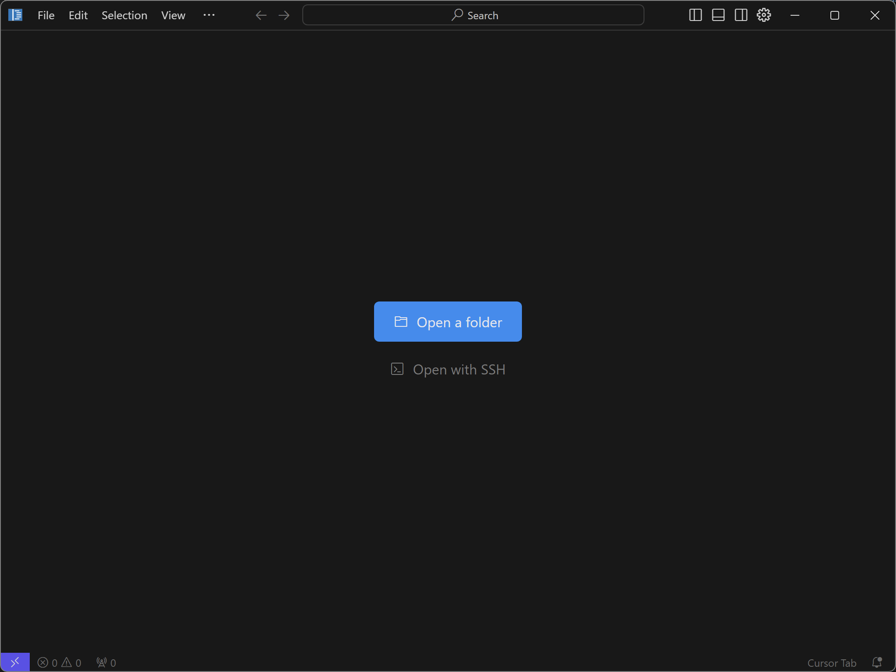
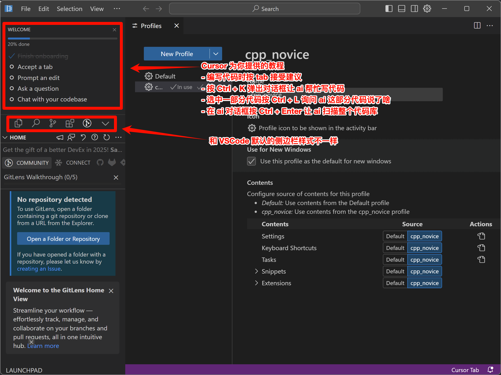
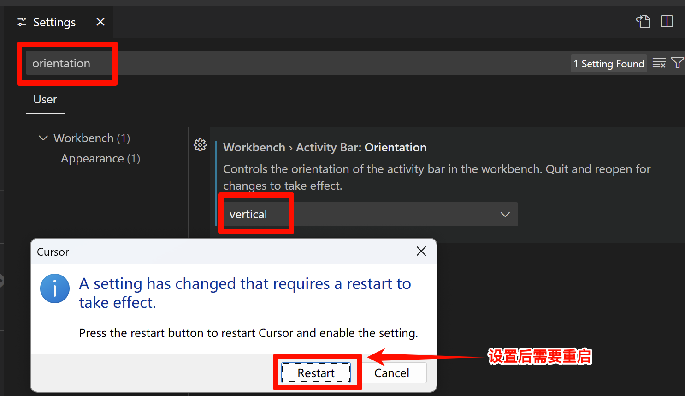
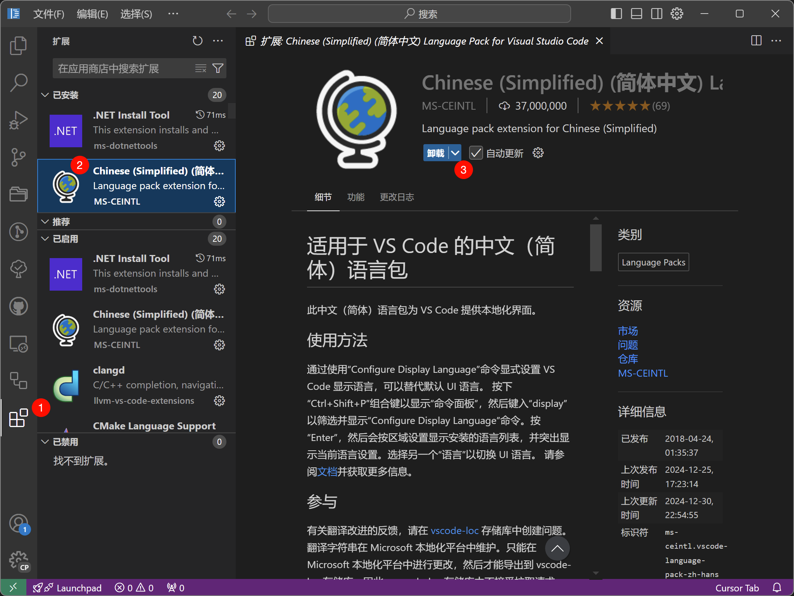
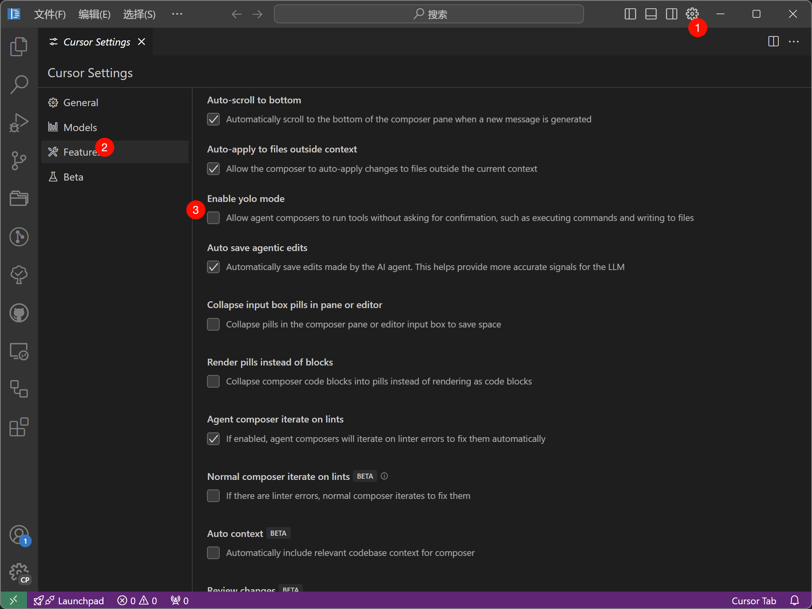
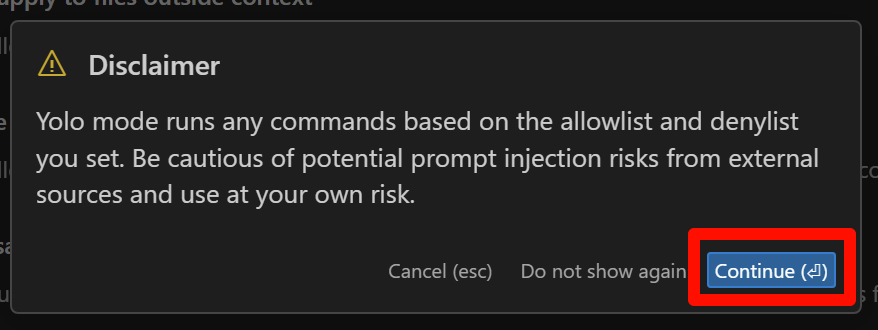

.. _cursor:

************************************************************************************************************************
另. 切换为使用 Cursor
************************************************************************************************************************

Cursor 是一款 ai 编辑器, 我个人感觉其 ai 体验比 VSCode 的 copilot 更好, 而且它还支持自定义 api.

Cursor 完全 fork 自 VSCode 并对 VSCode 迁移进行了适配, 具体地, 你需要进行以下步骤:

========================================================================================================================
安装软件
========================================================================================================================

你可以通过 `Cursor 官网 <https://www.cursor.com/>`_ 下载安装包来安装软件. 如果是 MacOS, 你还可以用 ``brew install cursor`` 来直接安装.

========================================================================================================================
启动时设置
========================================================================================================================

在软件启动时, 你可以对软件进行一些基础设置:

设置好基础甚至后, 软件将会询问你是否导入你的 VSCode 扩展、设置和快捷键等, 点击 :menuselection:`Use Extensions` 来导入:

导入完 VSCode 后, Cursor 会询问你是否愿意让它收集数据来改善软件, 按你的需要选择即可:

然后 Cursor 需要你登录/注册账号, Cursor 允许免费账号询问 ai 250 次, 如果要有更多次数则需要付费 (或者创建新账号?).

具体怎么注册此处不进行解释.

========================================================================================================================
为 Cursor 导入配置文件、恢复和 VSCode 一样的外观
========================================================================================================================

登录账号后, 我们会得到这样的界面:

我们通过 :KBD:`Ctrl-Shift-P` 或 :KBD:`Command⌘-Shift-P` 打开命令菜单, 输入 ``open profiles`` 以找到 :menuselection:`Preferences: Open Profiles (UI)` 以打开配置文件面板, 按照教程之前对 VSCode 那样导入并启用配置文件即可.

然后我们会得到如下侧边栏, 跟 VSCode 默认的样式不一样 (当然是指默认情况, VSCode 里也可以调成这种样式):

要想恢复原来的样式, 我们可以通过 :KBD:`Ctrl-Shift-P` 或 :KBD:`Command⌘-Shift-P` 打开命令菜单, 输入 ``open vscode settings`` 以找到 :menuselection:`Open VSCode Settings` 以打开 VSCode 设置面板, 搜索 ``orientation``, 然后将搜索到的选项从 :menuselection:`horizontal` 改为 :menuselection::`vertical`:

设置后, Cursor 会需要重启, 点击重启即可 (可能需要手动重新开一下).

========================================================================================================================
一些提示
========================================================================================================================

在重启之后, 你将会看到与 VSCode 差不多的界面, 但右上角多了一个 Cursor 自己的设置按钮.

------------------------------------------------------------------------------------------------------------------------
中文界面
------------------------------------------------------------------------------------------------------------------------

可能 Cursor 会变成中文, 也可能不会. 如果实在没变, 你可以去扩展重装中文插件再重启一下 Cursor:

------------------------------------------------------------------------------------------------------------------------
yolo 模式: 让 Cursor 自动修改你的代码、增删你的文件、帮你的前端代码打开浏览器调试……
------------------------------------------------------------------------------------------------------------------------

我们启用 yolo 模式:

之后将会给出一些可自定义的点, 请自行按需求自定义, 也可以不自定义直接使用.