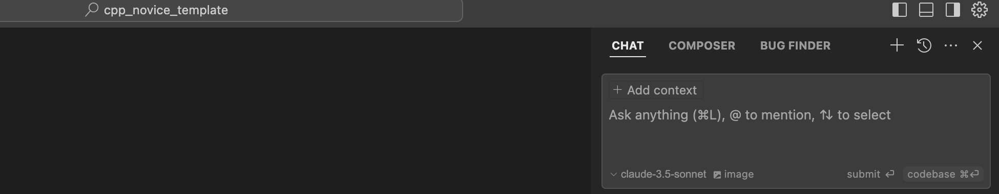
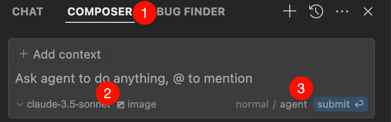
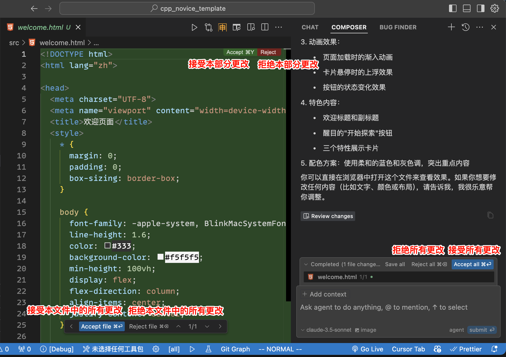
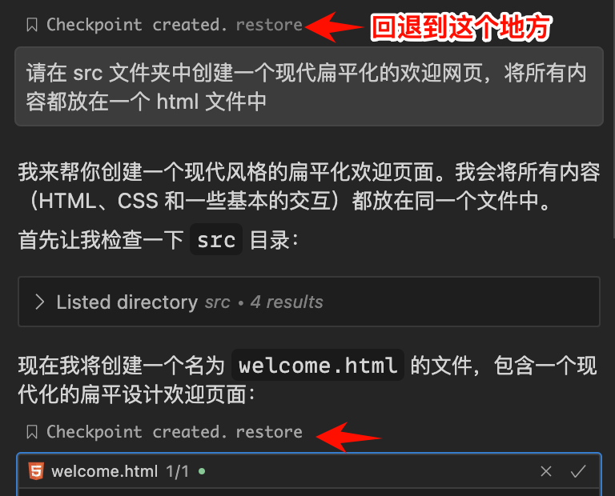

************************************************************************************************************************
另.切换为使用 Cursor
************************************************************************************************************************

Cursor 是一款 ai 编辑器, 我个人感觉其 ai 体验比 VSCode 的 copilot 更好, 而且它还支持自定义 api.

Cursor 完全 fork 自 VSCode 并对 VSCode 迁移进行了适配, 具体地, 你需要进行以下步骤:

========================================================================================================================
安装软件
========================================================================================================================

你可以通过 `Cursor 官网 <https://www.cursor.com/>`_ 下载安装包来安装软件. 如果是 MacOS, 你还可以用 ``brew install cursor`` 来直接安装.

========================================================================================================================
启动时设置
========================================================================================================================

在软件启动时, 你可以对软件进行一些基础设置:

.. figure:: 启动时基础设置.png

设置好基础甚至后, 软件将会询问你是否导入你的 VSCode 扩展、设置和快捷键等, 点击 :menuselection:`Use Extensions` 来导入:

.. figure:: 启动时询问VSCode扩展.png

导入完 VSCode 后, Cursor 会询问你是否愿意让它收集数据来改善软件, 按你的需要选择即可:

.. figure:: 启动时数据偏好.png

然后 Cursor 需要你登录/注册账号, Cursor 允许免费账号询问 ai 250 次, 如果要有更多次数则需要付费 (或者创建新账号?).

.. figure:: 启动时登录注册.png

具体怎么注册此处不进行解释.

========================================================================================================================
为 Cursor 导入配置文件、恢复和 VSCode 一样的外观
========================================================================================================================

登录账号后, 我们会得到这样的界面:

.. figure:: 主界面.png

我们通过 :KBD:`Ctrl-Shift-P` 或 :KBD:`Command⌘-Shift-P` 打开命令菜单, 输入 ``open profiles`` 以找到 :menuselection:`Preferences: Open Profiles (UI)` 以打开配置文件面板, 按照教程之前对 VSCode 那样导入并启用配置文件即可.

然后我们会得到如下侧边栏, 跟 VSCode 默认的样式不一样 (当然是指默认情况, VSCode 里也可以调成这种样式):

.. figure:: 侧边栏.png

要想恢复原来的样式, 我们可以通过 :KBD:`Ctrl-Shift-P` 或 :KBD:`Command⌘-Shift-P` 打开命令菜单, 输入 ``open vscode settings`` 以找到 :menuselection:`Open VSCode Settings` 以打开 VSCode 设置面板, 搜索 ``orientation``, 然后将搜索到的选项从 :menuselection:`horizontal` 改为 :menuselection:`vertical`:

.. figure:: 设置侧边栏.png

设置后, Cursor 会需要重启, 点击重启即可 (可能需要手动重新开一下).

========================================================================================================================
中文界面
========================================================================================================================

在重启之后, 你将会看到与 VSCode 差不多的界面, 但右上角多了一个 Cursor 自己的设置按钮.

这时候, 可能 Cursor 会变成中文, 也可能不会. 如果实在没变, 你可以去扩展重装中文插件再重启一下 Cursor:

.. figure:: 重装中文.png

========================================================================================================================
yolo 模式: 让 Cursor 自动修改你的代码、增删你的文件、帮你的前端代码打开浏览器调试……
========================================================================================================================

我们启用 yolo 模式:

.. figure:: 启用yolo模式.png

.. figure:: 同意免责声明.png

之后将会给出一些可自定义的点, 请自行按需求自定义, 也可以不自定义直接使用.

配置好后, 我们通过 :KBD:`Ctrl-Shift-P` 或 :KBD:`Command⌘-Shift-P` 打开命令菜单, 输入 ``toggle chat`` 以找到 :menuselection:`查看: 切换 Chat (View: Toggle Chat)` 以打开 Cursor 的 chat 面板:

在 chat 面板上有三个模式:

- Chat (默认快捷键 :KBD:`Ctrl-L` 或 :KBD:`Command⌘-L`): 正常的聊天模式, 询问问题然后得到回复.
- Composer (默认快捷键 :KBD:`Ctrl-I` 或 :KBD:`Command⌘-I`): 告诉 ai 你想做什么, **让它自动帮你修改代码、增删文件、打开浏览器、运行测试命令等等.** (你已经是一个成熟的 ai 了, 要学会自己写测试、写代码、运行测试、改代码直到测试通过.)
- Bug Finder: 自动查找当前打开文件夹中有无代码错误.

-------------------------------------------------------------------------------------------------------------------------
告知 ai 要参考的内容
-------------------------------------------------------------------------------------------------------------------------

我们可以告知 ai 要参考哪些内容 (当然在理解的过程中它可能自行查找文件夹中其他部分), 这有很多方式:

- 我们从侧边栏将文件拖动到 chat 窗口中;
- 我们点击输入框上面的 :menuselection:`+ Add context` 来自自行加入一些文件;
- 我们在输入框中输入 ``@`` 然后选择我们要加入的文件、文件夹、代码、文档、错误、网页、图片等;
- 我们复制粘贴要用的文件、文件夹、代码、文档、错误、网页、图片等;
- 仅在 Chat 模式下, 你可以用 :KBD:`Ctrl-回车` 或 :KBD:`Command⌘-回车` 告诉 ai 直接使用文件夹中所有文件.
- ……

-------------------------------------------------------------------------------------------------------------------------
Composer yolo 模式实战
-------------------------------------------------------------------------------------------------------------------------

接下来我将以创建一个网页为例, 展示如何使用 Composer yolo 模式.

首先, 我们切换为 Composer, 选择 claude-3.5-sonnet (2025/1/2 时这是最好的代码 ai), 改为 agent 模式:

然后, 加入我们可能要求 ai 参考的代码 (此处因示例简单, 我没有加入).

最后, 我们给出要求, 按下 :KBD:`回车`:

.. figure:: 对 composer 提要求.png

composer 将会陆续生成结果, 你可以接受或拒绝结果:

你也可以在聊天记录中选择回退到某个过程 (此处因为简单, 没有中间过程可以回退):

让我们用 VSCode 的预览来看看这个网页:

.. tabs::

  .. tab:: 预览按钮

    .. figure:: 预览按钮.png

  .. tab:: 网页结果

    .. figure:: 预览网页.png

.. hint::

  你也可以通过 VSCode 自带的时间线来回退文件内容:

  .. figure:: 时间线.png

注意, VSCode 时间线只能记录它上面的更改, 如果你在软件之外修改了文件, 那么无药可救.

但是你已经不小心删掉了文件? 别担心, **我们新建一个同名的文件, 就又能看到时间线了**.

========================================================================================================================
导入新的 VSCode
========================================================================================================================

如果需要重新导入 VSCode 配置, 你可以在 Cursor 设置中选择 :menuselection:`import`.