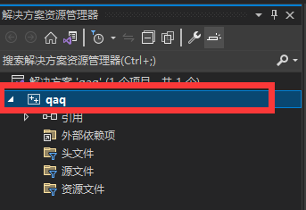

#####################################
附录5.一个简单的 Visual Studio 配置方案
#####################################

前言
*****

说是简单，但其实挺麻烦的；直接配置一个 VSCode 出来更好用；如果需要 Visual Studio 特有的一些诊断功能，可以将项目导入到 `Compiler Explorer - MSVC <https://godbolt.org/z/dG41xP6h3>`_ 中查看。

方案基于 Visual Studio 2022 配置。

主要做到了以下功能：

- 自动格式化代码

  .. note::

    一个按键就能解决的事，为什么考试试卷上的代码格式那么差呢……

  .. figure:: visual_studio_img/自动格式化对比.png

    自动格式化对比

- 更多的静态检查（但检查速度比 VSCode 慢得多）

未完成功能：

- 更好的字体和外观（不常用，忘了怎么配的了）

- 更多更多的静态检查（懒，摸了）

下载
*****

请自行去 `Visual Studio 官网 <https://visualstudio.microsoft.com/zh-hans/>`_ 下载 **Community 2022**。

如果是 Mac，还是老老实实配置 VSCode 吧。

安装
*****

在安装器中选择【使用 C++ 的桌面开发】，勾选到【适用于 Windows 的 C++ Clang 工具】为止。

.. note::

  如果已经安装过了，请通过电脑上的程序【Visual Studio Installer】修改你的安装。

.. figure:: visual_studio_img/安装.png

  安装 Visual Studio

配置
*****

新建一个 C++ 空项目。

自动格式化代码
=============

在上方工具栏选择【工具(T)】-【选项(O)...】，在弹出的窗口中依次选择【文本编辑器】-【C/C++】-【代码样式】-【格式设置】。

推荐按下图配置：

.. figure:: visual_studio_img/格式化配置.png

  格式化配置

点击【确定】关闭窗口，在上方工具栏选择【扩展(X)】-【管理扩展(M)】，搜索 ``format document on save``，选择搜索到的第一个并点击下载。

下载完成后关闭整个软件，将会弹出安装提示，选择【Modify】。

.. figure:: visual_studio_img/格式化扩展安装.png

  格式化扩展安装

此后，通过【Ctrl + S】或工具栏手动保存代码时，代码都将格式化。

更多的静态检查
=============

重新打开 Visual Studio 2022，并打开那个空项目， **创建一个 cpp 文件**。

.. note::

  **接下来的内容都只对当前项目有效，每次都需要重复配置。**

  更遗憾的是，很多检查都只在编译生成时才会进行，而 VSCode 是能在写代码的同时检查的。**这似乎有扩展解决了**，有需要的可以【扩展】里搜索 ``analysis``、 ``on save`` 之类的关键词找找；我不以 Visual Studio 为主，就不找了。

找到【解决方案资源管理器】，右键你所创建的项目，选择最下方的选项【属性(R)】。

  项目示意图

在弹出的窗口上方，选择 ``所有配置`` 和 ``所有平台``，接下来开始配置：

- 【常规】（可选）：将【C++ 语言标准】修改为 ``预览 - 最新 C++ 工作草案中的功能 (/std:c++latest)``，毕竟 C++ 版本越新越复杂、使用越简单。
- 【C/C++】-【命令行】：在下方【其他选项】中输入以下内容：（诊断选项解释见 :ref:`Visual Studio 附录`）

  .. code-block:: bash

    /permissive- /W4 /w14242 /w14254 /w14263 /w14265 /w14287 /we4289 /w14296 /w14311 /w14545 /w14546 /w14547 /w14549 /w14555 /w14619 /w14640 /w14826 /w14905 /w14906 /w14928

- 【Code Analysis】-【常规】：全部选 ``是``。
- 【Code Analysis】-【Microsoft】：下拉选择 ``<选择多个规则集...>``，勾选全部并点击【另存为】，然后选择另存为的那个规则集即可。

  .. figure:: visual_studio_img/Microsoft_规则集.png

    Microsoft 规则集

- 【Code Analysis】-【Clang-Tidy】：在【要启用或禁用的检查】中输入以下内容：（具体细节见 `Clang-Tidy 诊断选项列表`_）

  .. code-block:: bash

    *,-abseil*,-altera*,-fuchsia*,-llvmlib*,-llvm-qualified-auto,-zircon*,-google-readability-todo,-misc-unused-alias-decls,-modernize-use-trailing-return-type,-readability-braces-around-statements,-readability-implicit-bool-conversion,-readability-qualified-auto,-hicpp-braces-around-statements

此后，每当编译生成时，都会进行检查。

.. _`Visual Studio 附录`:

附录
*****

MSVC 的命令行选项
=================

MSVC（即 Visual Studio 系列，不包括 VS Code）推荐的错误检查选项（摘自 `cppbestpractices: Use the Tools Available - compilers - MSVC <https://github.com/cpp-best-practices/cppbestpractices/blob/master/02-Use_the_Tools_Available.md#msvc>`_）。

- 你应该默认启用的：``/W4 /w14640``
- 根据需要添加

  - ``/W4`` All reasonable warnings
  - ``/w14242`` 'identfier': conversion from 'type1' to 'type1', possible loss of data
  - ``/w14254`` 'operator': conversion from 'type1:field_bits' to 'type2:field_bits', possible loss of data
  - ``/w14263`` 'function': member function does not override any base class virtual member function
  - ``/w14265`` 'classname': class has virtual functions, but destructor is not virtual instances of this class may not be destructed correctly
  - ``/w14287`` 'operator': unsigned/negative constant mismatch
  - ``/we4289`` nonstandard extension used: 'variable': loop control variable declared in the for-loop is used outside the for-loop scope
  - ``/w14296`` 'operator': expression is always 'boolean_value'
  - ``/w14311`` 'variable': pointer truncation from 'type1' to 'type2'
  - ``/w14545`` expression before comma evaluates to a function which is missing an argument list
  - ``/w14546`` function call before comma missing argument list
  - ``/w14547`` 'operator': operator before comma has no effect; expected operator with side-effect
  - ``/w14549`` 'operator': operator before comma has no effect; did you intend 'operator'?
  - ``/w14555`` expression has no effect; expected expression with side-effect
  - ``/w14619`` pragma warning: there is no warning number 'number'
  - ``/w14640`` Enable warning on thread un-safe static member initialization
  - ``/w14826`` Conversion from 'type1' to 'type_2' is sign-extended. This may cause unexpected runtime behavior.
  - ``/w14905`` wide string literal cast to 'LPSTR'
  - ``/w14906`` string literal cast to 'LPWSTR'
  - ``/w14928`` illegal copy-initialization; more than one user-defined conversion has been implicitly applied