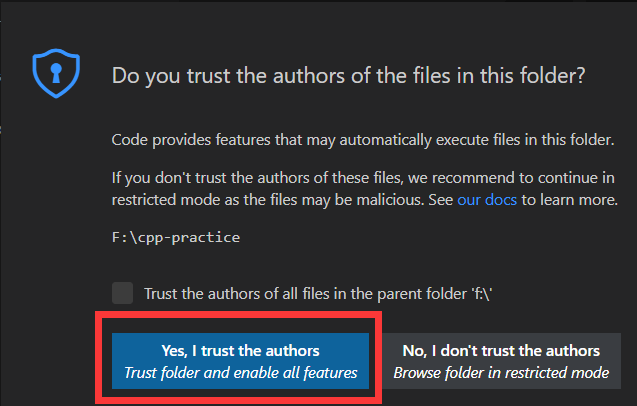

#####
配置
#####

.. include:: /_include/links.rst

.. ref:: download_and_unzip

下载并解压
**********

- `配置文件`_

**记得解压缩！记得解压缩！记得解压缩！**

- Windows：【右键】该文件，然后选择【提取】以提取文件。
- MacOS：【双击】该文件以提取文件。

.. note::

  - 这里写的都是系统内置的解压缩方法，如果有其他压缩软件请随意。
  - 解压在全英路径，且文件夹名不要有奇怪的标点符号乃至空格！
  - 不要图省事解压到桌面，以免因用户名过于奇怪而出错！—— **来自提问者的真实经历！**

.. ref:: open_the_folder

打开文件夹
**********

打开 VSCode，将解压得到的 cpp-practice 文件夹拖动到 VSCode 中。

.. note::

  - 拖动到右侧区域而非左边的侧边栏。
  - 不要自作主张用左上角菜单栏打开，因为该菜单下有两个对应操作，很容易犯错。

在弹出的界面中选择【是，我信任此作者(Yes, I trust the authros)】。

   安全性提示

将设置应用到全局
****************

.. note::

  下方有动图指导怎么操作。

1. 打开全局设置文件：

  - 点击窗口左下角的【齿轮】，选择【设置(settings)】，点击右上角第二栏第一个按钮【打开设置(Open Settings)】。

2. 打开局部设置文件：

  - 在左方侧边栏选择【资源管理器(Explorer)】，找到【.vscode】文件夹下的【settings.json】，打开。

3. 复制局部设置文件中的内容：

  - Windows：在打开的页面中【左键】，【Ctrl + A】全选，【Ctrl + C】复制。
  - MacOS：在打开的页面中【左键】，【Command + A】全选，【Command + C】复制。

4. 粘贴内容到全局设置文件中：

  - Windows：切换到另一个【settings.json】，在打开的页面中【左键】，【Ctrl + A】全选，【Ctrl + V】粘贴。
  - MacOS：切换到另一个【settings.json】，在打开的页面中【左键】，【Command + A】全选，【Command + V】粘贴。

5. 删除局部设置文件：

  【右击】侧边栏的【settings.json】，选择【删除(delete)】。

.. figure:: /_img/VSCode_应用设置.gif

   将设置应用到全局

安装插件
********

在左方侧边栏点击【扩展(Extensions)】，在出现的窗口中搜索 ``@recommended``，点击【云朵形状的下载图标】。

.. note::

  如果未能找到，请首先检查前面 :ref:`download_and_unzip` 或者 :ref:`open_the_folder` 的步骤有无疏忽。

观察下方，等所有插件右下角的【蓝色 install 按钮】消失变成【齿轮】，即安装全部完成。

**关闭 VSCode。**

.. figure:: /_img/VSCode_安装插件.png

   安装插件

.. note::

   如果之前装过一个名为 **C/C++** 插件，会弹出冲突提示，请选择【Disable IntelliSense】。

   .. figure:: /_img/插件冲突提示.jpeg

     插件冲突提示

为 CMake 选择编译器
*******************

重新启动 VSCode，会弹出如下图选项。

- Windows：选择 Clang 即可。
- MacOS：系统自带有 Clang 编译器，请注意选择 **homebrew** 路径下的版本。

.. figure:: /_img/MacOS_选择编译器.png

   MacOS 选择 homebrew 路径下的编译器

配置完成
********

通过【Ctrl + Shift + P】或【Command + Shift + P】打开命令菜单，输入 ``clangdr`` 以找到【clangd: Restart language server】，从而刷新配置。

.. note::

  当你的 C++ 源代码莫名其妙显示错误信息时，通过该步骤可能得到解决。

.. figure:: /_img/VSCode_刷新_clangd.png

   刷新 Clangd

你可以直接将这个【cpp-practice】文件夹作为学习 C++ 所用的文件夹，将代码放入【src】子文件夹中。

运行和调试代码的方法见下文。

.. note::

  如果需要在其他文件夹中应用配置，请看 :doc:`explain`