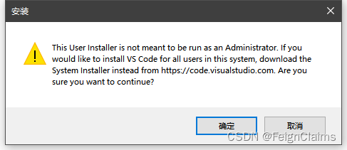

************************************************************************************************************************
安装 VSCode
************************************************************************************************************************

========================================================================================================================
下载
========================================================================================================================

- `VSCode: 通过官网下载`_ (需要注意的是，通过百度搜索到的前几个结果都不是官网！)
  
  .. figure:: VSCode_通过官网下载.png

    VSCode: 通过官网下载

========================================================================================================================
安装
========================================================================================================================

打开你所下载的 VSCode 安装包. 如果出现如图警告, 点击 :menuselection:`确定`.

.. note::

  这是由于我们下载的是 **用户安装包 (User Installer)** 而非 **系统安装包 (System Installer)**.

  如需 **系统安装包**，请前往 `VSCode: 通过官网下载`_ 下滑至最底部下载。

  VSCode 用户安装包警告
  
在第一页点 :menuselection:`我同意此协议`, 之后一直点 :menuselection:`下一步` 即可.
  

  VSCode 安装

关闭之后自动启动的软件.

========================================================================================================================
设置始终以管理员身份运行
========================================================================================================================

:KBD:`右键` VSCode, 选择 :menuselection:`属性`.

在弹出的窗口中点击 :menuselection:`兼容性`, 然后勾选 :menuselection:`以管理员身份运行此程序` 并 :menuselection:`确定`.

.. figure:: VSCode_以管理员身份运行.png

  勾选 :menuselection:`以管理员身份运行此程序`.
