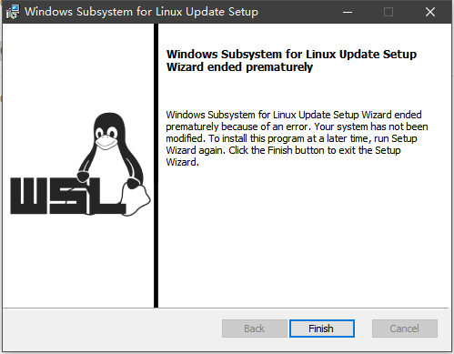
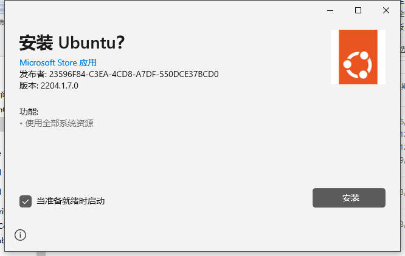
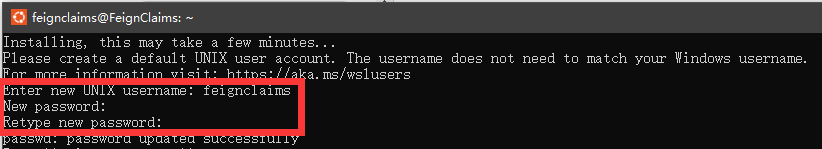

************************************************************************************************************************
安装 WSL
************************************************************************************************************************

========================================================================================================================
以管理员身份打开 PowerShell
========================================================================================================================

按 :KBD:`Win⊞-X`, 然后选择 :menuselection:`Windows PowerShell (管理员)(A)` 从而以管理员身份打开 PowerShell.

.. figure:: 以管理员身份打开 PowerShell.png

  以管理员身份打开 PowerShell

.. note::

  注意打开的窗口样式, 当输入命令后再次出现类似样式时, 说明命令执行完毕.

  .. figure:: PowerShell_窗口样式.png

    PowerShell 窗口样式

========================================================================================================================
启用 WSL 功能
========================================================================================================================

.. include:: /command_line_hint_wsl.irst

.. code-block:: bash

  dism.exe /online /enable-feature /featurename:Microsoft-Windows-Subsystem-Linux /all /norestart

.. code-block:: bash

  dism.exe /online /enable-feature /featurename:VirtualMachinePlatform /all /norestart

========================================================================================================================
禁用 Hyper-V
========================================================================================================================

运行后按提示重启电脑.

.. note::

  如果运行后提示 "功能名称 Microsoft-Hyper-V-Hypervisor 未知", 这并不影响后续内容, 直接重启电脑即可.

.. code-block:: bash

  Disable-WindowsOptionalFeature -Online -FeatureName Microsoft-Hyper-V-Hypervisor

========================================================================================================================
更新 Linux 内核
========================================================================================================================

下载 `Linux 内核更新包`_ 并双击运行, 不断确认, 最终按 :menuselection:`Finish` 即可.

========================================================================================================================
安装 WSL2
========================================================================================================================

下载 `WSL 安装包`_ 并双击 :menuselection:`安装` 即可.

安装完成后, 会自动弹出一个 WSL 的终端, 我们就在这个终端里进行之后的所有操作.

========================================================================================================================
注册用户账号
========================================================================================================================

首次打开终端时, 会要求我们注册一个用户账号. 具体地, 我们需要输入用户名, :KBD:`回车`, 输入密码, :KBD:`回车`, 再次输入密码, :KBD:`回车`.

