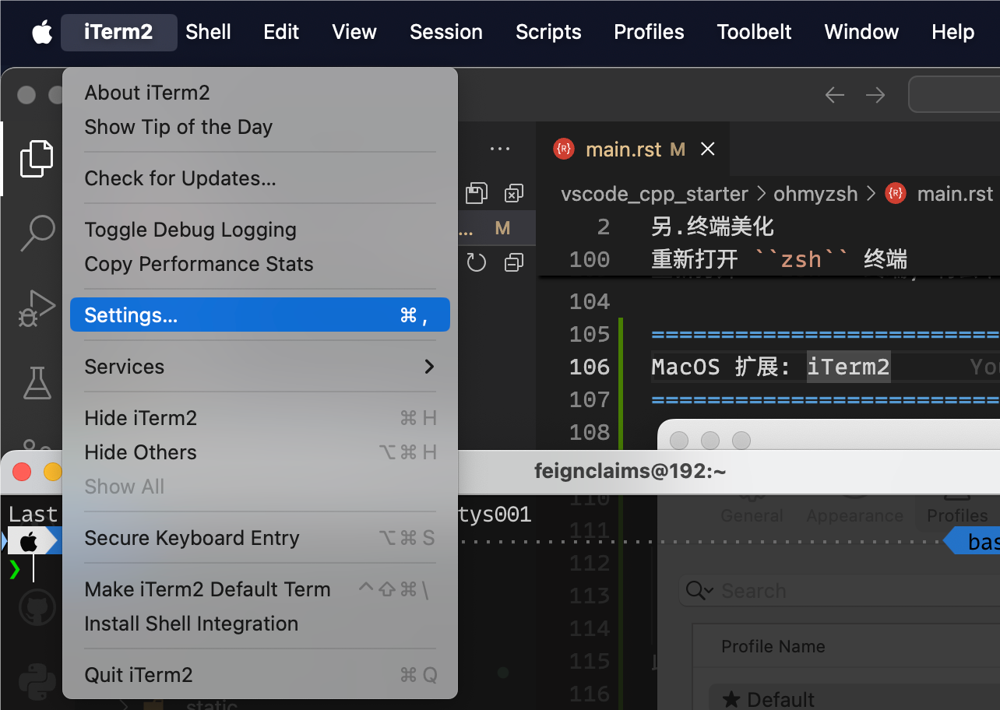
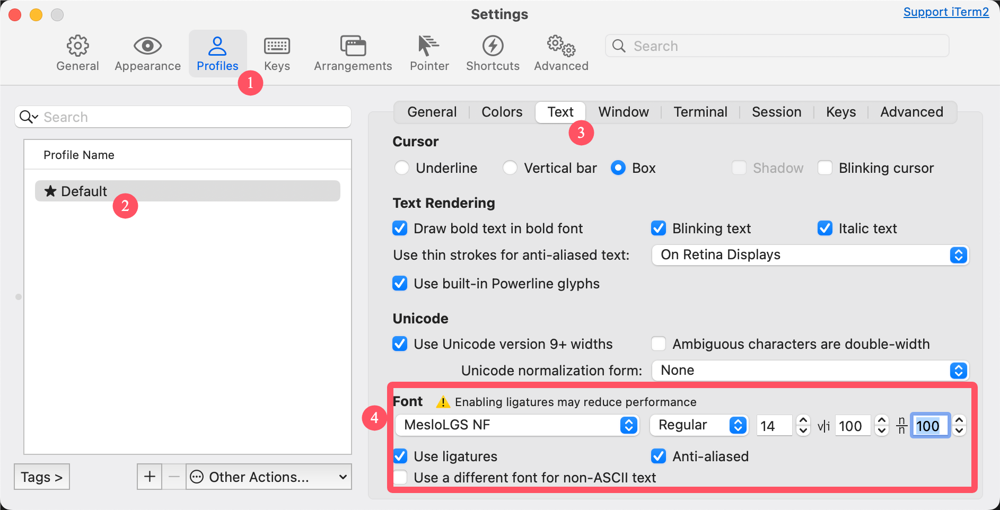
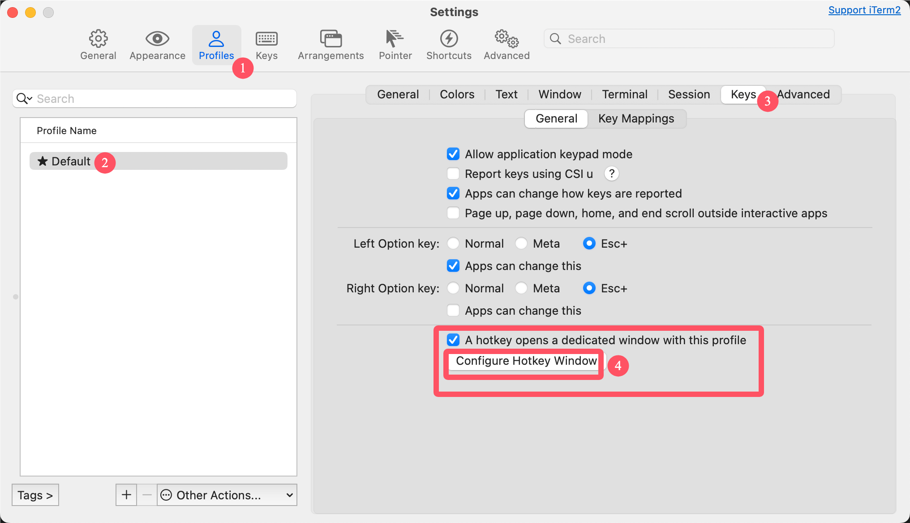
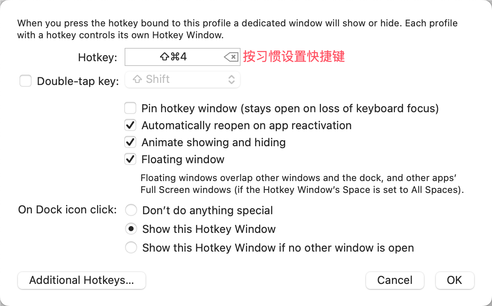

************************************************************************************************************************
另.终端美化
************************************************************************************************************************

.. warning::

  请确保网络可访问 github.

.. figure:: 美化后的终端.png

  我个人使用的终端外观

========================================================================================================================
安装前置软件
========================================================================================================================

------------------------------------------------------------------------------------------------------------------------
Windows (MSYS2)
------------------------------------------------------------------------------------------------------------------------

Windows 对 bash 或 zsh 的直接支持不太好, 不建议使用; 可考虑安装 Cmder 对终端进行美化.

------------------------------------------------------------------------------------------------------------------------
MacOS
------------------------------------------------------------------------------------------------------------------------

.. code-block:: bash

  brew install git

------------------------------------------------------------------------------------------------------------------------
Fedora
------------------------------------------------------------------------------------------------------------------------

.. code-block:: bash

  sudo dnf install git zsh

------------------------------------------------------------------------------------------------------------------------
Ubuntu/Debian
------------------------------------------------------------------------------------------------------------------------

.. code-block:: bash

  sudo apt install git zsh

========================================================================================================================
切换默认终端
========================================================================================================================

.. code-block:: bash

  chsh -s $(which zsh)

.. code-block:: bash

  zsh

.. note::

  对于图形软件, 你还需要对对应的 :menuselection:`终端 (terminal)` 软件设置进行调整, 将使用的终端改为 ``zsh``.

========================================================================================================================
安装 antidote 并使用它安装插件
========================================================================================================================

.. code-block:: bash

  git clone --depth=1 https://github.com/mattmc3/antidote.git ${ZDOTDIR:-~}/.antidote

.. code-block:: bash

  echo 'source ${ZDOTDIR:-~}/.antidote/antidote.zsh' >> ~/.zshrc
  echo 'autoload -Uz compinit && compinit' >> ~/.zshrc
  echo 'antidote load' >> ~/.zshrc
  echo 'autoload -Uz promptinit && promptinit && prompt powerlevel10k' >> ~/.zshrc
  source ~/.zshrc

.. code-block:: bash

  antidote install 'ohmyzsh/ohmyzsh path:lib'
  antidote install 'romkatv/powerlevel10k kind:fpath'
  antidote install 'ohmyzsh/ohmyzsh path:plugins/colored-man-pages'
  antidote install 'ohmyzsh/ohmyzsh path:plugins/colorize'
  antidote install 'ohmyzsh/ohmyzsh path:plugins/history'
  antidote install 'ohmyzsh/ohmyzsh path:plugins/magic-enter'
  antidote install 'zdharma-continuum/fast-syntax-highlighting'
  antidote install 'zsh-users/zsh-autosuggestions'

========================================================================================================================
安装字体
========================================================================================================================

为了使图标正确显示, 建议使用以下字体:

- `MesloLGS NF: 通过官网下载`_
- `MesloLGS NF: 我备份的文件`_ (分别点击进行下载)

========================================================================================================================
重新打开 ``zsh`` 终端
========================================================================================================================

重新打开 ``zsh`` 终端, 将会卡住一定时间. 此后即可开始配置终端样式, 请自行阅读显示的选项选择.

========================================================================================================================
扩展: vim 化终端命令行
========================================================================================================================

如果你习惯使用 vim, 则将终端也 vim 化将会非常方便. (如果不熟悉, 请考虑通过 :ref:`个人学习大纲 <question_board:learning_map>` 中的 "计算机教育中缺失的一课" 学习, 有了 vim 你将能脱离鼠标编程.)

.. code-block:: bash

  antidote install 'jeffreytse/zsh-vi-mode'

.. code-block:: bash

  echo '# zsh vim cursor style' >> ~/.zshrc
  echo 'ZVM_LINE_INIT_MODE=$ZVM_MODE_INSERT' >> ~/.zshrc
  echo 'ZVM_NORMAL_MODE_CURSOR=$ZVM_CURSOR_BLINKING_BLOCK' >> ~/.zshrc
  echo 'ZVM_INSERT_MODE_CURSOR=$ZVM_CURSOR_BLINKING_BEAM' >> ~/.zshrc

========================================================================================================================
MacOS 扩展: iTerm2
========================================================================================================================

相较于自带的终端, 安装 iTerm2 将会给你更好的终端使用体验.

.. code-block:: bash

  brew install iterm2

安装好后启动 iTerm2, 按提示将其设为默认终端.

然后在屏幕左上方打开设置.

  打开设置

按下图设置字体为 ``MesloLGS NF``:

  设置字体

此处的配置非常可供自定义, 我仅推荐一个极其常用的功能: 快捷键打开浮动终端.

  打开浮动窗口设置

  设置浮动窗口

此后, 在 iterm2 启动的情况下, 你可以用快捷键启动终端, **这样启动的终端即使在全屏时也能无缝使用**.

.. hint::

  你还可以 ``brew install dash`` 软件, 它将允许你浮动地查看、搜索各种官方文档.

  .. figre:: dash_设置.png

    设置

  .. figre:: dash_使用演示.png

    使用演示