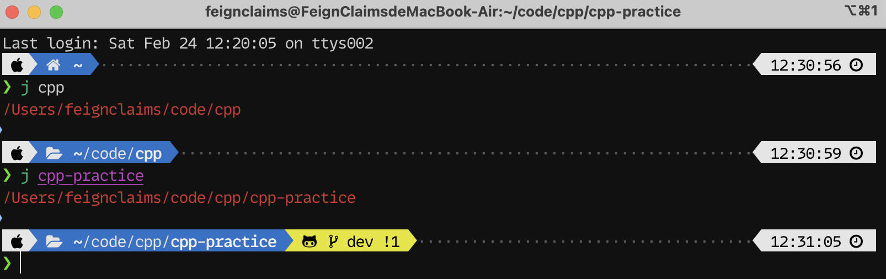

************************************************************************************************************************
另.终端美化 (MacOS/Linux)
************************************************************************************************************************

  我个人使用的终端外观

========================================================================================================================
安装前置软件
========================================================================================================================

MacOS
  .. code-block:: bash

    brew install git

Fedora
  .. code-block:: bash

    sudo dnf install git zsh

Ubuntu/Debian
  .. code-block:: bash

    sudo apt install git zsh

========================================================================================================================
切换默认终端
========================================================================================================================

.. code-block:: bash

  chsh -s $(which zsh)

对于图形软件, 你还需要对对应的 :menuselection:`终端 (terminal)` 软件设置进行调整, 将使用的终端改为 ``zsh``.

========================================================================================================================
安装 antidote 并使用它安装插件
========================================================================================================================

.. code-block:: bash

  git clone --depth=1 https://github.com/mattmc3/antidote.git ${ZDOTDIR:-~}/.antidote

.. code-block:: bash

  echo 'ohmyzsh/ohmyzsh path:lib' >> ~/.zsh_plugins.txt

  echo 'romkatv/powerlevel10k kind:fpath' >> ~/.zsh_plugins.txt

  echo 'ohmyzsh/ohmyzsh path:plugins/colored-man-pages' >> ~/.zsh_plugins.txt
  echo 'ohmyzsh/ohmyzsh path:plugins/colorize' >> ~/.zsh_plugins.txt
  echo 'ohmyzsh/ohmyzsh path:plugins/history' >> ~/.zsh_plugins.txt
  echo 'ohmyzsh/ohmyzsh path:plugins/magic-enter' >> ~/.zsh_plugins.txt
  echo 'zdharma-continuum/fast-syntax-highlighting' >> ~/.zsh_plugins.txt
  echo 'zsh-users/zsh-autosuggestions' >> ~/.zsh_plugins.txt

.. code-block:: bash

  echo 'source ${ZDOTDIR:-~}/.antidote/antidote.zsh' >> ~/.zshrc
  echo 'autoload -Uz compinit && compinit' >> ~/.zshrc
  echo 'antidote load' >> ~/.zshrc
  echo 'autoload -Uz promptinit && promptinit && prompt powerlevel10k' >> ~/.zshrc

========================================================================================================================
安装字体
========================================================================================================================

为了使图标正确显示, 建议使用以下字体:

- `MesloLGS NF: 通过官网下载`_
- `MesloLGS NF: 我备份的文件`_ (分别点击进行下载)
