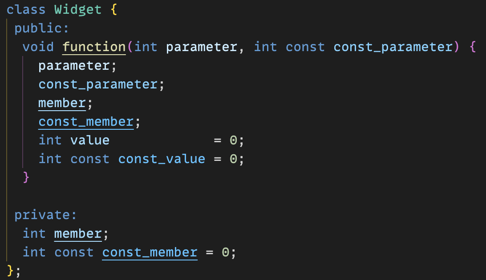
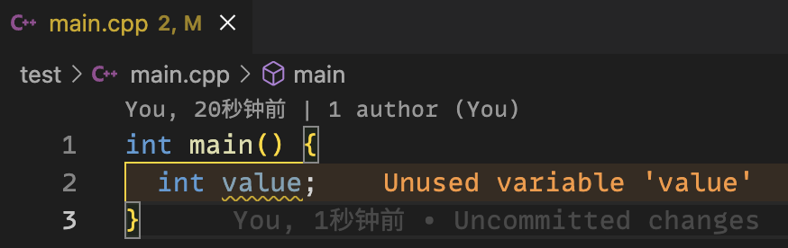
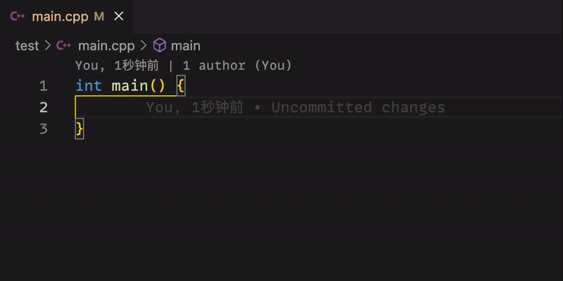
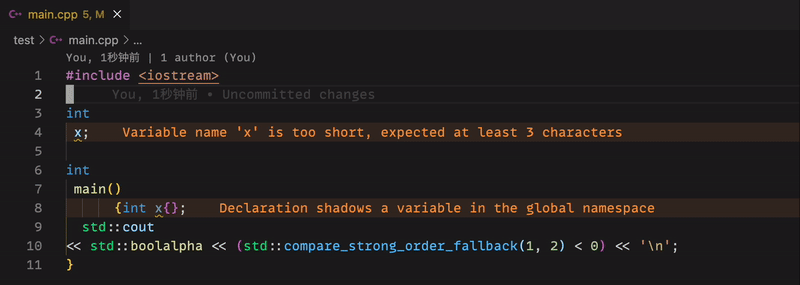
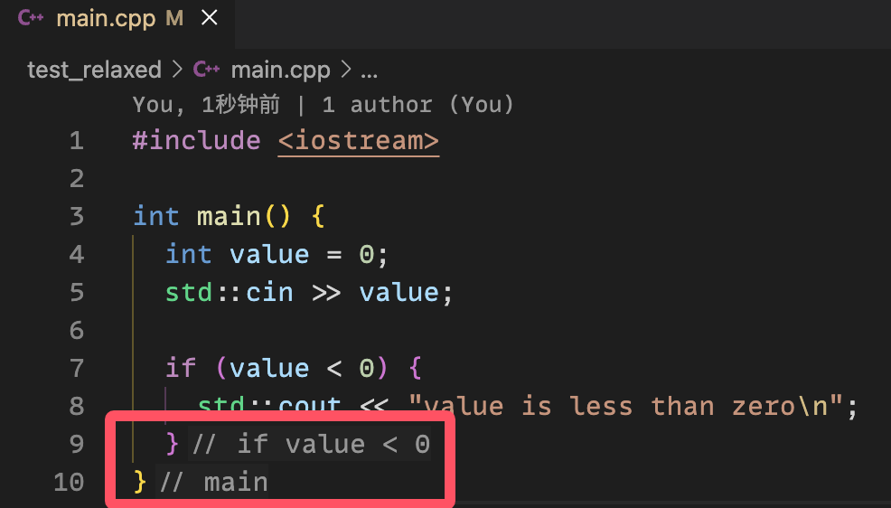
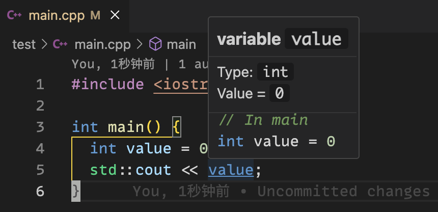
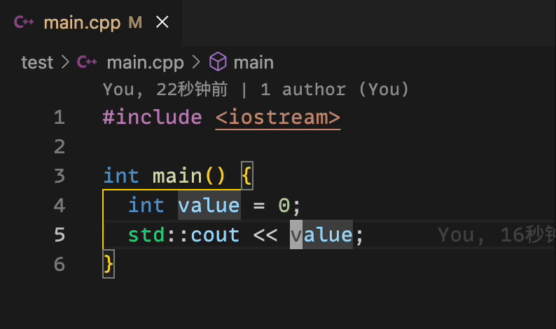
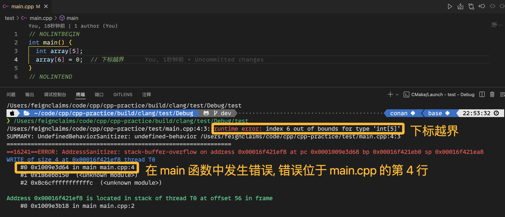
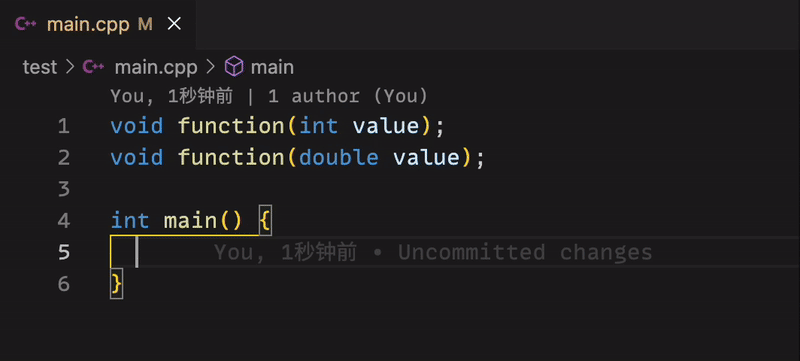
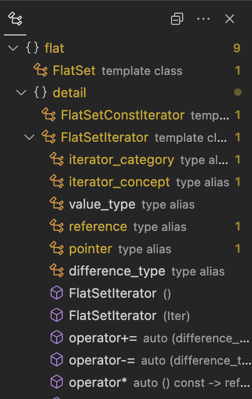

************************************************************************************************************************
0.使用本教程能得到的功能
************************************************************************************************************************

以下是对本教程所配置的 VSCode 额外拥有的功能的统计, 按照需要的 C++ 理解程度从上到下排序 (**非常不完全**, 仅列出对初学者帮助较大的功能中的少部分).

.. hint::

  附录中有解释这些内容具体是如何配置的, 又该如何更可控地使用. **请在配置完成、有一定 C++ 基础后尝试阅读.**

------------------------------------------------------------------------------------------------------------------------
代码拥有更丰富的字体和颜色
------------------------------------------------------------------------------------------------------------------------

clangd 计算了各种语义符号, 允许用户在 VSCode 设置中用 ``editor.semanticTokenColorCustomizations`` 对各种语义的字体、颜色进行自定义.

我于是利用 VSCode 默认的 Dark 和 Light 主题的互补色、相近色, 对变量、const 变量、成员变量、函数参数等各种内容进行了区分.

------------------------------------------------------------------------------------------------------------------------
代码行内显示警告和错误
------------------------------------------------------------------------------------------------------------------------

利用 Error Lens 插件, VSCode 将能在代码行内显示警告和错误, 这能大幅改善代码编写体验.

------------------------------------------------------------------------------------------------------------------------
自动添加头文件
------------------------------------------------------------------------------------------------------------------------

clangd 提供了自动添加头文件功能: clangd 常常在我们编写代码时提供建议列表, 当我们通过 :KBD:`回车` 选择建议列表中的项后, 它将自动添加对应的头文件.

------------------------------------------------------------------------------------------------------------------------
自动格式化
------------------------------------------------------------------------------------------------------------------------

clangd 为 VSCode 提供了 clang-format 支持, 因而在通过 :KBD:`Ctrl-S` 或 :KBD:`Command⌘-S` 或工具栏手动保存代码时, 代码将会被格式化.

------------------------------------------------------------------------------------------------------------------------
代码中显示额外信息 (inlay hints)
------------------------------------------------------------------------------------------------------------------------

clangd 会在代码间显示额外信息, 如 :cpp:`if` 语句在哪结束、函数在哪结束、下标序号、类型推导结果等.

------------------------------------------------------------------------------------------------------------------------
鼠标悬停显示代码信息
------------------------------------------------------------------------------------------------------------------------

clangd 提供了鼠标悬停显示代码信息功能: 当我们将鼠标放置在代码上时, 将会显示对应的信息.

.. hint::

  你也可以自定义快捷键在光标所在处显示代码信息.

------------------------------------------------------------------------------------------------------------------------
一键重命名标识符
------------------------------------------------------------------------------------------------------------------------

clangd 提供了一键重命名标识符功能: 我们可以按 :KBD:`F2` 对当前光标所在的标识符进行重命名, 这样代码中所有对它的使用都将被重命名.

.. warning::

  该重命名功能在有些时候不能进行, 且不允许标识符被重命名为与 *当前位置可见的其他标识符* 相同的名字.

------------------------------------------------------------------------------------------------------------------------
同时管理多个程序
------------------------------------------------------------------------------------------------------------------------

本配置采用 CMake 进行项目管理, 因此可以在一个项目中管理多个程序: 一个程序由一个包含 :cpp:`main()` 函数的主源文件和零或多个其他源文件构成. 这样一来, 我们不必新建一整个项目来进行下一个练习——我们只需要在本项目中再添加一个程序.

.. seealso::

  请在完成配置后, 阅读 :doc:`/add_your_program/main` 以了解如何添加新的程序.

------------------------------------------------------------------------------------------------------------------------
Sanitizer 检查下标越界等运行时错误
------------------------------------------------------------------------------------------------------------------------

本配置用 `aminya/project_options`_ 为 CMake 完成项目配置, 并利用它默认启用了 address sanitizer 和 undefined behaviour sanitizer. 这意味着, 如果我们 **实际运行程序** 时遇到了下标越界、整型溢出等未定义行为, 程序将会报错并为我们提供相关信息.

------------------------------------------------------------------------------------------------------------------------
更多的静态检查和自动修复
------------------------------------------------------------------------------------------------------------------------

clangd 为 VSCode 提供了 clang-tidy 支持, 将会在编写代码时实时调用 clang-tidy 进行静态检查. 它会对变量未初始化, :cpp:`if` 中的 :cpp:`==` 写成了 :cpp:`=` 等上百种问题进行检查, 并为一些常见的问题提供了自动修复方法. 具体请在配置完成后参考 :doc:`/appendix/about_warnings/main`.

此外, 我还相比于默认配置, 为编译器启动了更多的警告诊断.

.. warning::

  为了初学者不过于受影响, 我关闭了很多严格的警告. 如果想要开发一个成熟的项目而启用更多警告, 请在配置完成后参考 :doc:`/appendix/learning` 和 :doc:`/appendix/bibliography`.

------------------------------------------------------------------------------------------------------------------------
显示可供调用的函数签名
------------------------------------------------------------------------------------------------------------------------

在调用函数时, clangd 将会展示出目前可供调用的函数.

.. hint::

  你可以自定义快捷键来切换显示的函数签名, 就像动图里那样.

------------------------------------------------------------------------------------------------------------------------
代码结构导航
------------------------------------------------------------------------------------------------------------------------

clangd 允许 VSCode 的大纲获知当前源文件的代码结构, 此外还提供了各种在代码结构中跳转的方法.

------------------------------------------------------------------------------------------------------------------------
交叉引用
------------------------------------------------------------------------------------------------------------------------

变量会被声明和使用, 函数会被声明和调用…… clangd 支持在文件间或文件内查找符号被用在了其他哪些地方:

- 通过 :KBD:`Ctrl-鼠标左击` 或 :KBD:`Command⌘-鼠标左击`, 我们将能在鼠标点击的符号和它的定义之间跳转.
- 通过 :KBD:`F12`, 我们将能在光标所在的符号和它的定义之间跳转.
- 通过 :KBD:`Shift-F12`, 我们将能在代码区域中打开一个小窗口, 临时地查看光标所在的符号的所有被使用地点.
- ……

.. hint::

  更多功能可通过在代码区域右键了解到.

------------------------------------------------------------------------------------------------------------------------
一键第三方库安装
------------------------------------------------------------------------------------------------------------------------

本配置用 `aminya/project_options`_ 为 CMake 完成项目配置, 它支持几乎一键完成第三方库的安装和使用. 具体请在配置完成后参考 :doc:`/third_party/index` 和配置好的文件夹中的 ``请读我`` 文件.