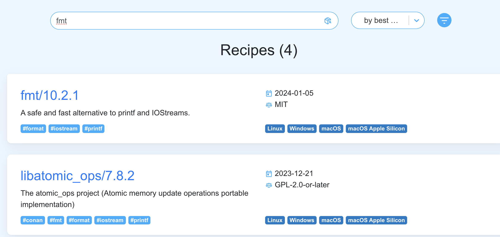
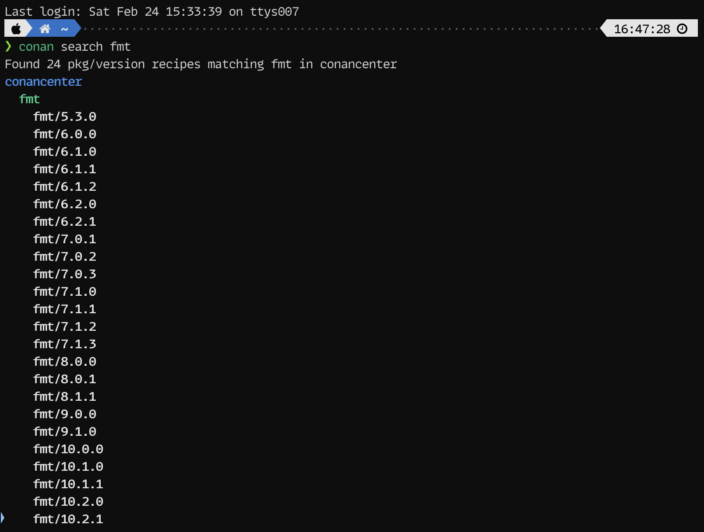
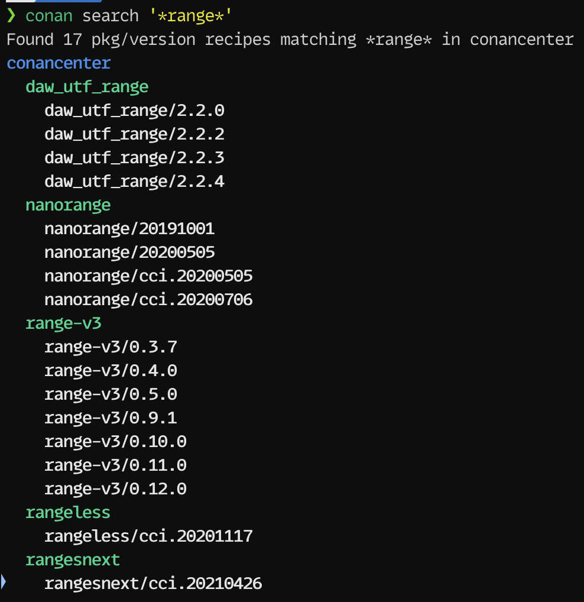
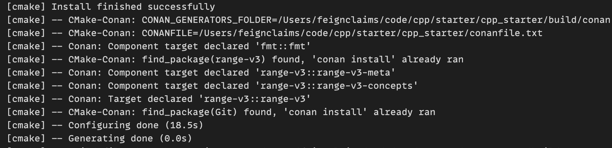

************************************************************************************************************************
使用 conan
************************************************************************************************************************

.. warning::

  请确保网络可访问 github.

.. hint::

  :ref:`同样地 <解释_学习模板>`, 该方法适用于任何支持 CMake 的软件 (Visual Studio 2022、Qt Creator、CLion 等).

如果是 2024 年 2 月 24 日前的旧学习模板, 请先更新学习模板 (`cpp_novice`_, `ppp2_novice`_ 或 `ppp3_novice`_).

========================================================================================================================
安装 conan
========================================================================================================================

------------------------------------------------------------------------------------------------------------------------
Windows (MSYS2)
------------------------------------------------------------------------------------------------------------------------

通过 :menuselection:`开始` 菜单 (一般在左下角, Win11 在中间位置), 或 **MSYS2 安装路径** (默认为 ``C:\msys64``) 找到 **clang64** 或 **clang64.exe**.

:KBD:`右键` 该文件, 选择 :menuselection:`以管理员身份运行`.

.. code-block:: bash

  pacman -S python

.. code-block:: bash

  pip3 install conan

------------------------------------------------------------------------------------------------------------------------
MacOS
------------------------------------------------------------------------------------------------------------------------

.. code-block:: bash

  brew install python

.. code-block:: bash

  pip3 install conan

------------------------------------------------------------------------------------------------------------------------
Fedora
------------------------------------------------------------------------------------------------------------------------

.. code-block:: bash

  sudo dnf install python

.. code-block:: bash

  pip3 install conan

------------------------------------------------------------------------------------------------------------------------
Ubuntu/Debian
------------------------------------------------------------------------------------------------------------------------

.. code-block:: bash

  sudo apt install python

.. code-block:: bash

  pip3 install conan

========================================================================================================================
在 cpp_novice 中启用 conan
========================================================================================================================

在 ``cpp_novice`` 文件夹根目录中找到 ``CMakeLists.txt``, 在 ``include(cpp_novice_fetch_project_options)``, ``project(...)`` 之前添加一行 ``run_conan()``.

.. code-block:: cmake
  :emphasize-lines: 5
  :linenos:

  cmake_minimum_required(VERSION 3.25)

  list(APPEND CMAKE_MODULE_PATH "${CMAKE_CURRENT_SOURCE_DIR}/cmake")
  include(cpp_novice_fetch_project_options)
  run_conan()

  project(cpp_novice LANGUAGES CXX)

========================================================================================================================
搜索第三方库
========================================================================================================================

------------------------------------------------------------------------------------------------------------------------
通过网页搜索
------------------------------------------------------------------------------------------------------------------------

打开 `Conan Center`_ 进行搜索.

以 ``fmt`` 为例, 搜索结果中将会显示第三方库的最新版本, 点击可以查看更多信息.

  网页搜索 ``fmt``

------------------------------------------------------------------------------------------------------------------------
通过终端搜索
------------------------------------------------------------------------------------------------------------------------

打开 :menuselection:`终端 (Terminal)`, 输入 ``conan search <package_name>`` 进行搜索, 其中 ``<package_name>`` 是你要查找的包名.

以 ``fmt`` 为例, 将返回如下结果:

  终端搜索 ``fmt``

对于不确定的内容, 你可以用 ``*`` 表示通配, 但注意使用字符串包裹起来:

  终端搜索 ``'*range*'``

========================================================================================================================
添加第三方库
========================================================================================================================

根据搜索结果, 我们找到了 ``fmt/10.2.1``. 假设这就是我们要使用的库.

要使用它则需要在合适的位置添加它, 为此先要简单理解 ``cpp_novice`` 的项目管理是如何达成的.

------------------------------------------------------------------------------------------------------------------------
添加原理
------------------------------------------------------------------------------------------------------------------------

整个 ``cpp_novice`` 文件夹是用 CMake 进行的项目管理, 其配置文件即根目录下的 ``CMakeLists.txt``.

打开 ``CMakeLists.txt`` 你可以看到 ``add_program(...)`` 函数, 这是我为了新手使用方便, 对 CMake 进行的简化: 通过 ``add_program(<程序名> <源文件1> [源文件2]...)`` 即可添加一个名为 ``<程序名>`` 的程序.

.. code-block:: cmake
  :linenos:

  add_program(example_multiple         # 程序名为 example_multiple
    src/example_multiple/main.cpp   # 源文件 1
    src/example_multiple/hello.cpp  # 源文件 2
  )

所谓添加第三方库, 就是由 CMake 找到第三方库, 并将第三方库链接到程序中.

1. 通过某种方式 (此处为 conan) 下载第三方库并告知 CMake 第三方库的存在.

2. 在 CMake 中查找第三方库, 这一般通过 ``find_package(<第三方库包名> CONFIG REQUIRED)`` 进行.

3. 在 CMake 中链接第三方库, 这一般通过 ``target_link_libraries(<程序名> PRIVATE <第三方库目标名>)`` 进行.

第三方库的添加即依次进行以上步骤.

------------------------------------------------------------------------------------------------------------------------
下载并告知 CMake 第三方库的存在
------------------------------------------------------------------------------------------------------------------------

以库 ``fmt/10.2.1`` 和 ``range-v3/0.12.0`` 为例.

在 ``cpp_novice`` 文件夹根目录中找到 ``conanfile.txt``, 在 ``[requires]`` 下方添加一行 ``fmt/10.2.1`` 和 ``range-v3/0.12.0``:

.. code-block:: text
  :emphasize-lines: 5-6
  :linenos:

  [layout]
  cmake_layout

  [requires]
  fmt/10.2.1
  range-v3/0.12.0

  [generators]
  CMakeDeps

添加后, 重新配置 CMake, 此时 CMake 将会调用 conan 下载第三方库 (:KBD:`Ctrl` + :KBD:`Shift` + :KBD:`P` 或 :KBD:`Command⌘` + :KBD:`Shift` + :KBD:`P` 打开命令菜单, 输入 ``cmake configure`` 以找到 :menuselection:`CMake: 配置`, :KBD:`回车`).

配置完成后, conan 将会提示我们如何在 CMake 中使用第三方库:

  conan 给出的提示: ``find_package(<包名>)`` 和 ``target_link_libraries(... <目标名>)``

------------------------------------------------------------------------------------------------------------------------
在 CMake 中查找并链接第三方库
------------------------------------------------------------------------------------------------------------------------

我为了新手使用方便, 对这个流程进行了简化.

打开 ``CMakeLists.txt``, 找到 ``add_program_options``:

- 在 ``DEPENDENCIES`` 下方添加包名 ``fmt`` 和 ``range-v3``.
- 在 ``LIBRARIES`` 下方添加目标名 ``fmt::fmt`` 和 ``range-v3::range-v3``.

.. code-block:: cmake
  :emphasize-lines: 3-4, 7-8
  :linenos:

  add_program_options(
    DEPENDENCIES
    fmt
    range-v3

    LIBRARIES
    fmt::fmt
    range-v3::range-v3

    INCLUDES
    include
  )

此后, 所有用 ``add_program`` 添加的程序均能使用该第三方库.

========================================================================================================================
扩展阅读
========================================================================================================================

该教程是非常简化的方案, 因而可能不适用于某些情况. 如果需要更多应用或自定义, 请自行学习以下内容:

- Conan 官方文档: `Conan 2.0 Documentation`_
- 如何用 Conan 自定义包: `Adding Packages to ConanCenter`_
- :doc:`/appendix/learning`
- 我基于 conan 的项目模板: `FeignClaims/cpp_conan_template`_
