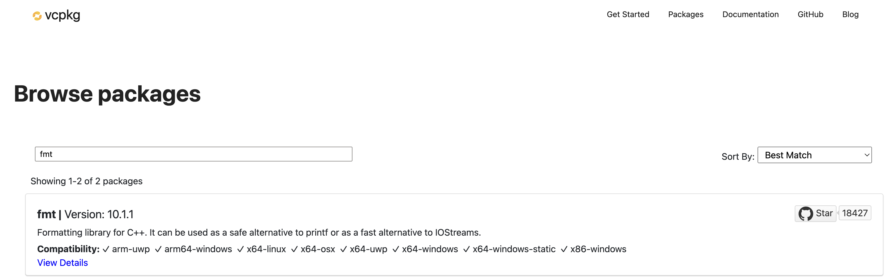
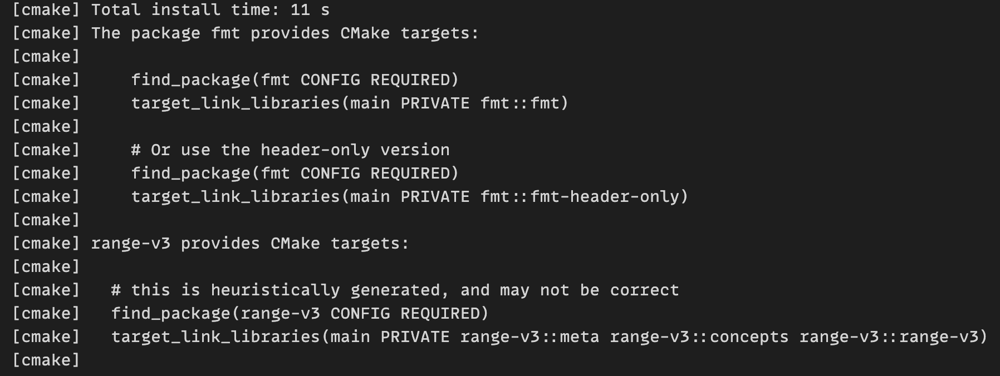

************************************************************************************************************************
使用 vcpkg
************************************************************************************************************************

.. warning::

  请确保网络可访问 github.

.. hint::

  :ref:`同样地 <解释_配置文件>`, 该方法适用于任何支持 CMake 的软件 (Visual Studio 2022、Qt Creator、CLion 等).

请先更新 `配置文件`_.

========================================================================================================================
在 cpp_starter 中启用 vcpkg
========================================================================================================================

在 ``cpp_starter`` 文件夹根目录中找到 ``CMakeLists.txt``, 在 ``include(fetch_project_options)``, ``project(...)`` 之前添加一行 ``run_vcpkg()``.

.. code-block:: cmake
  :emphasize-lines: 5
  :linenos:

  cmake_minimum_required(VERSION 3.25)

  list(APPEND CMAKE_MODULE_PATH "${CMAKE_CURRENT_SOURCE_DIR}/cmake")
  include(fetch_project_options)
  run_vcpkg()

  project(cpp_starter LANGUAGES CXX)

========================================================================================================================
搜索第三方库
========================================================================================================================

打开 `Browse public vcpkg packages`_ 进行搜索.

以 ``fmt`` 为例, 搜索结果中将会显示第三方库的最新版本, 点击可以查看更多信息.

  网页搜索 ``fmt``

========================================================================================================================
添加第三方库
========================================================================================================================

根据搜索结果, 我们找到了 ``fmt``. 假设这就是我们要使用的库.

要使用它则需要在合适的位置添加它, 为此先要简单理解 ``cpp_starter`` 的项目管理是如何达成的.

------------------------------------------------------------------------------------------------------------------------
添加原理
------------------------------------------------------------------------------------------------------------------------

整个 ``cpp_starter`` 文件夹是用 CMake 进行的项目管理, 其配置文件即根目录下的 ``CMakeLists.txt``.

打开 ``CMakeLists.txt`` 你可以看到 ``add_code(...)`` 函数, 这是我为了新手使用方便, 对 CMake 进行的简化: 通过 ``add_code(<程序名> <源文件1> [源文件2]...)`` 即可添加一个名为 ``<程序名>`` 的程序.

.. code-block:: cmake
  :linenos:

  add_code(example_multiple         # 程序名为 example_multiple
    src/example_multiple/main.cpp   # 源文件 1
    src/example_multiple/hello.cpp  # 源文件 2
  )

所谓添加第三方库, 就是由 CMake 找到第三方库, 并将第三方库链接到程序中.

1. 通过某种方式 (此处为 vcpkg) 下载第三方库并告知 CMake 第三方库的存在.

2. 在 CMake 中查找第三方库, 这一般通过 ``find_package(<第三方库包名> CONFIG REQUIRED)`` 进行.

3. 在 CMake 中链接第三方库, 这一般通过 ``target_link_libraries(<程序名> PRIVATE <第三方库目标名>)`` 进行.

第三方库的添加即依次进行以上步骤.

------------------------------------------------------------------------------------------------------------------------
下载并告知 CMake 第三方库的存在
------------------------------------------------------------------------------------------------------------------------

以库 ``fmt`` 和 ``range-v3`` 为例.

在 ``cpp_starter`` 文件夹根目录中找到 ``vcpkg.json``, 在 ``"dependencies"`` 的 ``[]`` 下方添加 ``fmt`` 和 ``range-v3``:

.. code-block:: text
  :emphasize-lines: 4-5
  :linenos:

  {
    "$schema": "https://raw.githubusercontent.com/microsoft/vcpkg-tool/main/docs/vcpkg.schema.json",
    "dependencies": [
      "fmt",
      "range-v3"
    ]
  }

添加后, 重新配置 CMake, 此时 CMake 将会自动下载 vcpkg, 并用它下载第三方库 (:KBD:`Ctrl`+:KBD:`Shift`+:KBD:`P` 或 :KBD:`Command ⌘`+:KBD:`Shift`+:KBD:`P` 打开命令菜单, 输入 ``cmake configure`` 以找到 :menuselection:`CMake: 配置`, :KBD:`回车`).

配置完成后, vcpkg 将会提示我们如何在 CMake 中使用第三方库:

  vcpkg 给出的提示: ``find_package(<包名>)`` 和 ``target_link_libraries(... <目标名>)``

------------------------------------------------------------------------------------------------------------------------
在 CMake 中查找并链接第三方库
------------------------------------------------------------------------------------------------------------------------

我为了新手使用方便, 对这个流程进行了简化.

打开 ``CMakeLists.txt``, 找到 ``add_code_options``:

- 在 ``DEPENDENCIES`` 下方添加包名 ``fmt`` 和 ``range-v3``.
- 在 ``LIBRARIES`` 下方添加目标名 ``fmt::fmt``, ``range-v3::meta``, ``range-v3::concepts`` 和 ``range-v3::range-v3``.

.. code-block:: cmake
  :emphasize-lines: 3-4, 7-10
  :linenos:

  add_code_options(
    DEPENDENCIES
    fmt
    range-v3

    LIBRARIES
    fmt::fmt
    range-v3::meta
    range-v3::concepts
    range-v3::range-v3

    INCLUDES
    include
  )

此后, 所有用 ``add_code`` 添加的程序均能使用该第三方库.

========================================================================================================================
扩展阅读
========================================================================================================================

笔者自己并不常使用 vcpkg, 请通过官网等自己学习.
