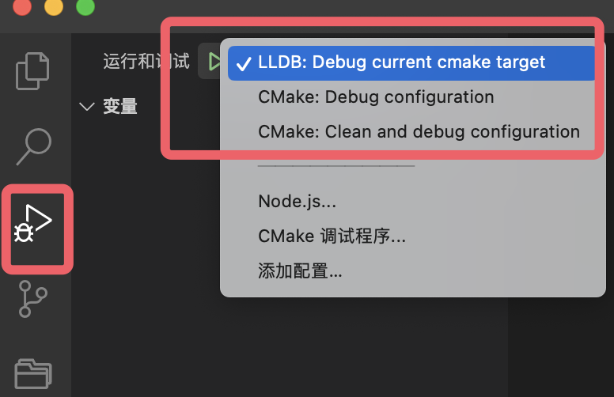
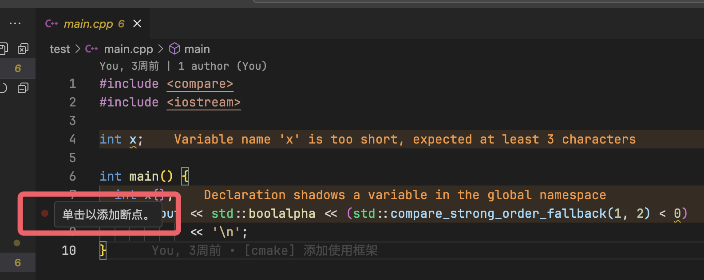

************************************************************************************************************************
调试程序
************************************************************************************************************************

========================================================================================================================
选择运行任务
========================================================================================================================

VSCode 只是通用的编辑器, 并不知道你会如何进行调试或运行, 所以需要在 ``.vscode/launch.json`` 中手动配置运行任务. 教程中已经对此进行配置, 以下展示如何使用.

从左侧侧边栏切换到 :menuselection:`运行和调试`, 点击上方 :menuselection:`▶播放按钮` 右侧下拉框, 则如图所示:

图中展示了三个我已配置好的运行任务, 你可以点击 :menuselection:`▶播放按钮` 或按快捷键 :KBD:`F5` 运行选择的任务:

:menuselection:`LLDB: debug the active target`
  使用 LLDB 软件对 CMake *当前预运行的目标* 进行调试, 在此即对选择的 C++ 程序进行调试.

:menuselection:`CMake: debug configuration`
  对 CMake 的配置即 ``CMakeLists.txt`` 进行调试.

:menuselection:`CMake: clean and debug configuration`
  清理之前的 CMake 配置缓存, 并对 CMake 的配置即 ``CMakeLists.txt`` 进行调试.

========================================================================================================================
调试 test
========================================================================================================================

根据上面的描述, 要调试 test, 我们将 *当前预生成的目标* 和 *当前预运行的目标* 均设置为 :menuselection:`[test]`, 点击 :menuselection:`运行和调试 --> ▶播放按钮` 或按快捷键 :KBD:`F5` 即可.

当然, 在调试前, 我们需要在 test 程序对应的源文件 :cpp:`test/index.cpp` 中设置断点:

1. 点开 ``test/index.cpp``.
2. 选择要中断的行, 通过 :KBD:`左击` 行号左边空白区域设置断点, 例如设置在第 7 行 :cpp:`int x{};` 处.

  设置断点

.. hint::

  更多调试相关内容见于 :ref:`断点调试的使用 <question_board:debugger>`.