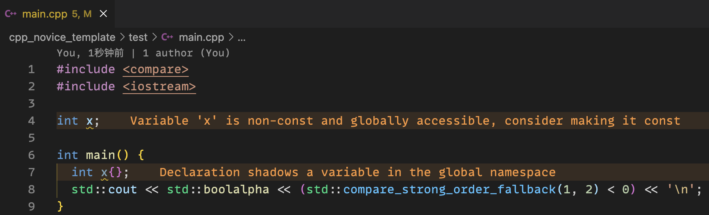

************************************************************************************************************************
观察诊断信息
************************************************************************************************************************

观察 ``int main()`` 函数内的 ``int x{};``, ``x`` 下方应有黄线.

- 黄色的信息为警告, 表示代码写得可能不够好, 如何处理见于 :doc:`/appendix/about_warnings/main`.
- 红色的信息为错误, 表示代码无法运行.

  诊断信息

此外, 代码高亮软件 clangd 还提供了一些内嵌提示, 你可以通过 :KBD:`Ctrl` + :KBD:`Shift` + :KBD:`P` 或 :KBD:`Command⌘` + :KBD:`Shift` + :KBD:`P` 打开命令菜单, 输入 ``inlay`` 以找到 :menuselection:`clangd: Toggle inlay hints`, :KBD:`回车` 来开启或关闭:

.. tabs::

  .. tab:: 无内嵌提示

    .. figure:: 无内嵌提示.png

  .. tab:: 有内嵌提示

    .. figure:: 有内嵌提示.png