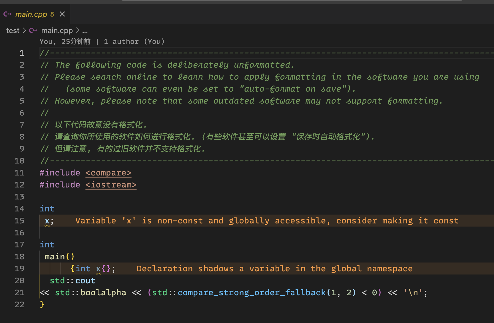
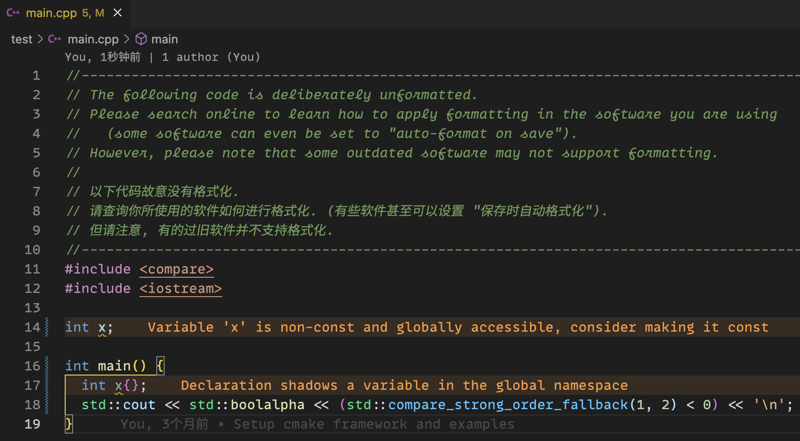

************************************************************************************************************************
格式化代码
************************************************************************************************************************

打开代码后, 你可以看到代码内容如下所示:

  代码

**这太丑了!**

让我们点击代码, 按 :KBD:`Ctrl` + :KBD:`S` 或 :KBD:`Command⌘` + :KBD:`S` 手动保存代码. 由于我配置了保存时自动格式化, 此后代码就会被格式化为以下格式:

  格式化后的代码