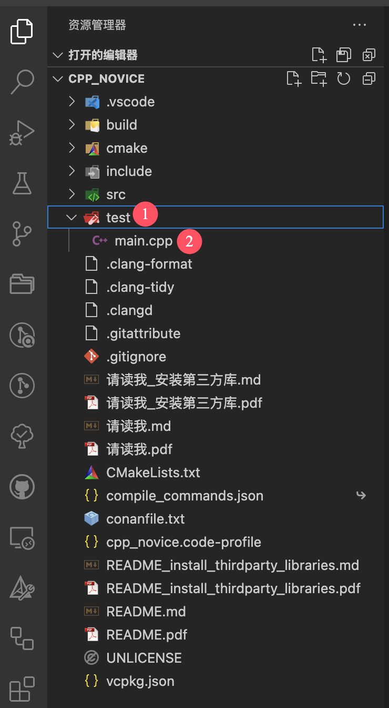

************************************************************************************************************************
3.检验配置结果和实际使用
************************************************************************************************************************

从左边侧边栏打开 test/index.cpp (test 文件夹下的 main.cpp 文件), 以下操作均在 test/index.cpp 中进行.

.. note::

  如果左边没有侧边栏, 点击下图按钮展开侧边栏的资源管理器.

  .. figure:: 展开资源管理器.png

.. note::

  如果资源管理器下没有文件显示, 请点击 :menuselection:`CPP_NOVICE` 展开文件夹. 当然, 你可能是 :menuselection:`PPP2_NOVICE` 或 :menuselection:`PPP3_NOVICE`.

  .. figure:: 展开文件夹.png

.. toctree::
  :maxdepth: 1
  :caption: 目录

  format/index
  diagnostics/index
  run/index
  debug/index