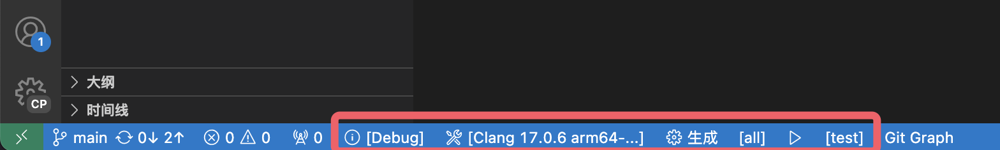

************************************************************************************************************************
运行程序
************************************************************************************************************************

========================================================================================================================
CMake 状态栏
========================================================================================================================

如果配置成功, 在 VSCode 下方状态栏将会显示类似这样的一行:

此处我们只关注从 :menuselection:`ⓘ[Debug]` 起的右边部分.

------------------------------------------------------------------------------------------------------------------------
构建相关
------------------------------------------------------------------------------------------------------------------------

:menuselection:`ⓘ[Debug]`
  当前所选择的构建配置, 指示按什么配置来生成编译程序, 点击可以切换.

  .. admonition:: 不同的构建配置介绍
    :class: dropdown

    Debug
      调试版本, 一般由程序员用于调试. 它不对代码做任何优化并且会记录代码与程序间的对应关系 (称为调试信息), 从而允许实际地逐行执行代码.

    Release
      发行版本, 即最终发布给用户的版本. 基于 as-if 规则, 它只需要保证程序运行起来就像代码看起来那样 (as-is), 因而可以对代码进行尽可能的优化.

      需要注意的是, 针对程序中的有符号数溢出、下标越界等未定义行为, 它怎么优化都可以, 因而即使炸掉你的电脑也是可能的, 所以不要让代码中有未定义行为.

    RelWithDebInfo
      具有调试信息的发行版本. 由于未定义行为等的存在, 我们可能遇到调试版本能正常运行, 但发行版本出现问题的情况, 此构建配置即用于调试这种情况.

      由于发行版本对代码进行优化, 调试过程中可能出现一下跳过好几行的情况, 这是正常的.

    MinSizeRel
      以最小大小为首要目标进行优化的发行版本.

    **喜欢谈优化的新手请先知道有不同的构建配置; 抱怨程序慢的人请先切换到 Release 构建配置.**

:menuselection:`⚒[Clang 17.0.6 arm64-...]`
  当前选择的工具包或配置档案, 指示用什么软件来生成编译程序, 此处即 :doc:`/configure/index` 中选择的编译器 Clang.

------------------------------------------------------------------------------------------------------------------------
编译生成
------------------------------------------------------------------------------------------------------------------------

:menuselection:`⚙生成`
  点击即可对 *当前预生成的目标* 进行编译生成.

:menuselection:`[all]`
  *当前预生成的目标*. 点击可以切换, :menuselection:`[all]` 表示编译生成所有目标.

  .. figure:: cmake选择生成目标.png
  
    点击后弹出的选择窗口, 展示目前项目中所有可用生成目标.

------------------------------------------------------------------------------------------------------------------------
运行
------------------------------------------------------------------------------------------------------------------------

:menuselection:`▶播放按钮`
  点击即可对 *当前预运行的目标* 进行运行, 也可以用快捷键 :KBD:`Shift-F5` 进行运行.

:menuselection:`[test]`
  *当前预运行的目标*, 点击可以切换. 在运行前会先对 *当前预生成的目标* 和 *当前预运行的目标* 进行生成.

  .. warning::

    该按钮初次配置时可能不会显示, 点击一次 :menuselection:`▶播放按钮`, 在弹出的选项中随便选一个作为 *当前预运行的目标* 即可.

========================================================================================================================
运行 test
========================================================================================================================

根据上面的描述, 要运行 test, 我们将 *当前预生成的目标* 和 *当前预运行的目标* 均设置为 :menuselection:`[test]`, 点击 :menuselection:`▶播放按钮` 或按快捷键 :KBD:`Ctrl-F5` (MacOS 也是 :KBD:`Ctrl`) 即可. 注意, 如果自己以前安装过 VSCode C/C++ 插件, 它会与这个快捷键按键冲突, 因而不能直接用这个快捷键需要自己更改.

如果配置成功, VSCode 将会打开 :menuselection:`终端`, 运行程序, 并输出 :cpp:`true`.

.. hint::

  CMake Tools 扩展除状态栏提供的功能外, 还提供了非常多的功能, 建议通过 `VSCode CMake 拓展用户手册`_ 学习.
