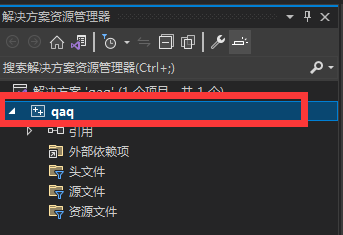

************************************************************************************************************************
对项目层次进行配置
************************************************************************************************************************

.. include:: ../common/project_warning.irst

重新打开 Visual Studio 2022, 并打开那个空项目, **创建一个 cpp 文件**.

========================================================================================================================
更多的静态检查
========================================================================================================================

找到 :menuselection:`解决方案资源管理器`, 右键你所创建的项目, 选择最下方的选项 :menuselection:`属性(R)`.

  项目示意图

在弹出的窗口上方, 选择 ``所有配置`` 和 ``所有平台``, 接下来开始配置:

- :menuselection:`常规`: 将 :menuselection:`C++ 语言标准` 修改为 :menuselection:`预览 - 最新 C++ 工作草案中的功能 (/std:c++latest)`, 毕竟 C++ 版本越新越复杂、使用越简单.
- :menuselection:`C/C++ --> 命令行`: 在下方 :menuselection:`其他选项` 中输入以下内容: (诊断选项解释见 :ref:`Visual Studio 附录`)

  .. code-block:: bash

    /permissive- /W4 /w14242 /w14254 /w14263 /w14265 /w14287 /we4289 /w14296 /w14311 /w14545 /w14546 /w14547 /w14549 /w14555 /w14619 /w14640 /w14826 /w14905 /w14906 /w14928

- :menuselection:`Code Analysis --> 常规`: 全部选 :menuselection:`是`.
- :menuselection:`Code Analysis --> Microsoft`: 下拉选择 :menuselection:`<选择多个规则集...>`, 勾选全部并点击 :menuselection:`另存为`, 然后选择另存为的那个规则集即可.

  .. figure:: Microsoft_规则集.png

    Microsoft 规则集

- :menuselection:`Code Analysis --> Clang-Tidy`: 在 :menuselection:`要启用或禁用的检查` 中输入以下内容: (具体细节见 `Clang-Tidy 诊断选项列表`_)

  .. code-block:: bash

    *,-abseil*,-altera*,-fuchsia*,-llvmlib*,-llvm-qualified-auto,-zircon*,-google-readability-todo,-misc-unused-alias-decls,-modernize-use-trailing-return-type,-readability-braces-around-statements,-readability-implicit-bool-conversion,-readability-qualified-auto,-hicpp-braces-around-statements

此后, 每当编译生成时, 都会进行检查.

========================================================================================================================
启用地址擦除系统 (AddressSanitizer)
========================================================================================================================

找到 :menuselection:`解决方案资源管理器`, 右键你所创建的项目, 选择最下方的选项 :menuselection:`属性(R)`.

在弹出的窗口上方, 选择 ``所有配置`` 和 ``所有平台``, 接下来开始配置:

- :menuselection:`C/C++ --> 常规`: 将 :menuselection:`启动地址擦除系统` 修改为 :menuselection:`是 (/fsanitize=address)`.
- :menuselection:`C/C++ --> 代码生成`: 将 :menuselection:`基本运行时检查` 修改为 :menuselection:`默认值`.
- :menuselection:`链接器 --> 常规`: 将 :menuselection:`启动增量链接` 修改为 :menuselection:`否 (/INCREMENTAL:NO)`.

关闭窗口, 点击主窗口上方的 :menuselection:`工具(T) --> 选项(O)...`, 在弹出的窗口中将 :menuselection:`调试 --> .NET/C++ 热重载` 中所有选项取消勾选.