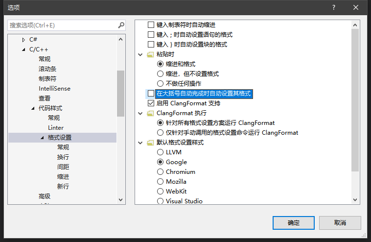
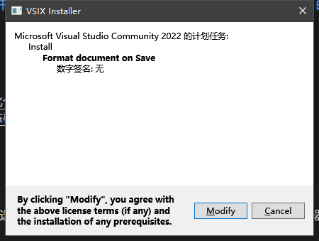

************************************************************************************************************************
对软件层次进行配置
************************************************************************************************************************

新建一个 C++ 空项目.

------------------------------------------------------------------------------------------------------------------------
自动格式化代码
------------------------------------------------------------------------------------------------------------------------

在上方工具栏选择 :menuselection:`工具(T) --> 选项(O)...`, 在弹出的窗口中依次选择 :menuselection:`文本编辑器 --> C/C++ --> 代码样式 --> 格式设置`.

推荐按下图配置:

  格式化配置

点击 :menuselection:`确定` 关闭窗口, 在上方工具栏选择 :menuselection:`扩展(X) --> 管理扩展(M)`, 搜索 ``format document on save``, 选择搜索到的第一个并点击下载.

下载完成后关闭整个软件, 将会弹出安装提示, 选择 :menuselection:`Modify`.

  格式化扩展安装

此后, 通过 :KBD:`Ctrl` + :KBD:`S` 或 :KBD:`Command⌘` + :KBD:`S` 或工具栏手动保存代码时, 代码都将格式化.

------------------------------------------------------------------------------------------------------------------------
行内显示警告信息
------------------------------------------------------------------------------------------------------------------------

按上文同样操作, 这次搜索 ``Visual Studio Show Inline Errors``.