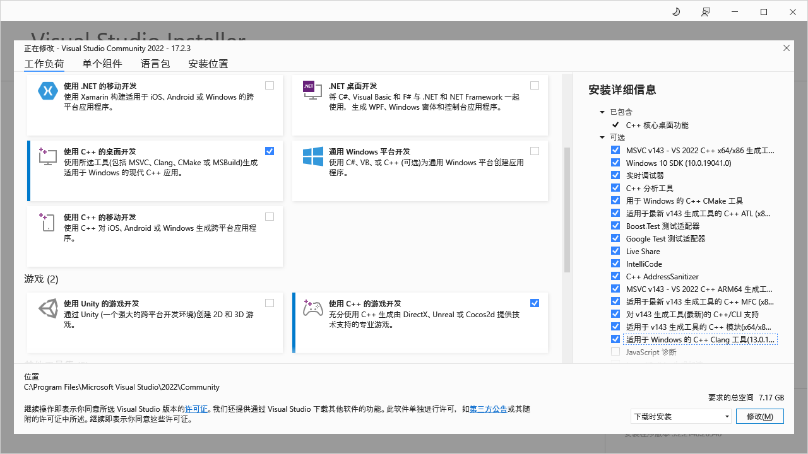

************************************************************************************************************************
下载和安装
************************************************************************************************************************

========================================================================================================================
下载
========================================================================================================================

请自行去 `Visual Studio 官网 <https://visualstudio.microsoft.com/zh-hans/>`_ 下载 **Community 2022**.

如果是 Mac, 还是老老实实配置 VSCode 吧.

========================================================================================================================
安装
========================================================================================================================

在安装器中选择 :menuselection:`使用 C++ 的桌面开发`, 勾选到 :menuselection:`适用于 Windows 的 C++ Clang 工具` 为止.

.. note::

  如果已经安装过了, 请通过电脑上的程序 :menuselection:`Visual Studio Installer` 修改你的安装.

  安装 Visual Studio